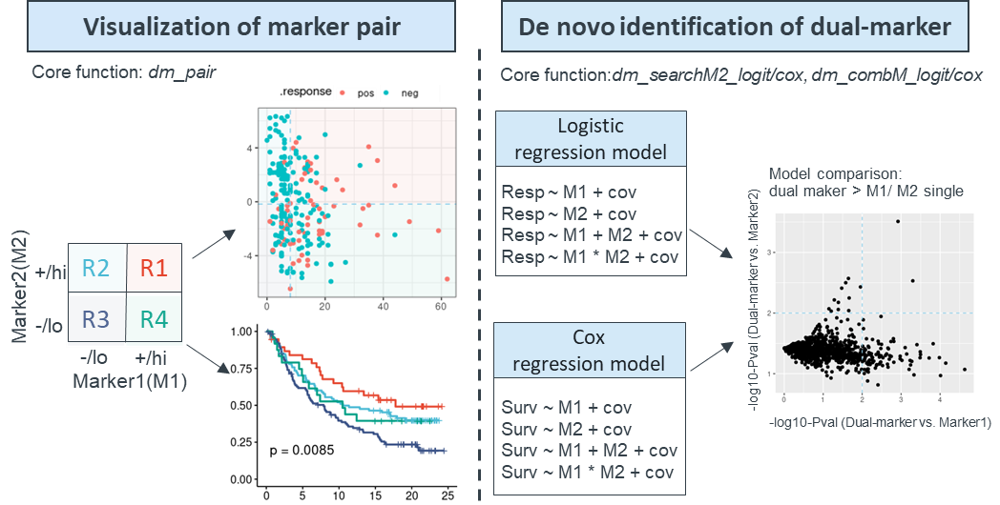
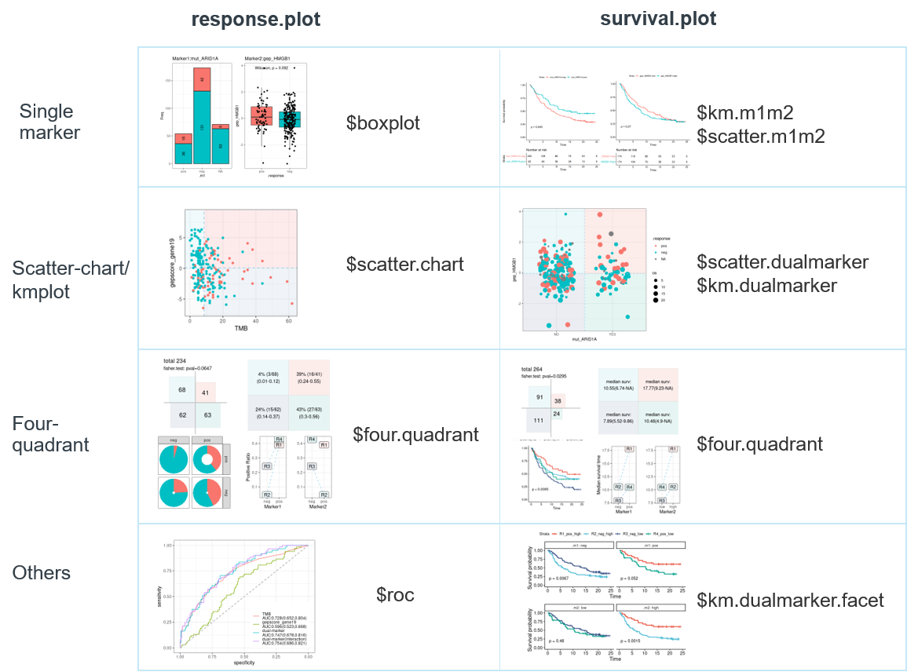

<!-- README.md is generated from README.Rmd. Please edit that file -->

```{r, include = FALSE}
knitr::opts_chunk$set(
  collapse = TRUE,
  comment = "#>",
  warning = FALSE,
  message = FALSE,
  fig.path = "man/figures/README-"
  #out.width = "100%"
)
```

# dualmarker
<!-- badges: start -->
<!-- badges: end -->

*Dualmarker* is designed for data exploration and hypothesis generation for dual biomarkers. It provides intuitive visualizations and extensive assessment of two marker combinations using logistic regression model for binary outcome (response analysis) and Cox regression for time-to-event outcome (survival analysis). It performs dual marker analysis via two distinct modules, one for evaluation of specific biomarker pair through *dm_pair* function, which comprehensively reveals the correlation among two markers, response and survival using over 14 sub-plots,such as boxplots, scatterplots, ROCs, and Kaplan-Meier plots. Another  module is de-novo identification and prioritization of marker2 among candidate markers in combination with known marker1 to predict response and survival through *dm_searchM2_cox* and *dm_searchM2_logit* function, its expansion version works for all biomarker combination to prioritize the most significant pair through *dm_combM_cox* and *dm_combM_logit* function. It is applicable for both response and survival analyses and compatible with both continuous and categorical variables. This figure illustrates the framework of this package.



## Installation

- Install the latest developmental version from [GitHub](https://github.com/maxiaopeng/dualmarker) as follow: 

```{r, eval = FALSE}
if(!require(devtools)) install.packages("devtools")
devtools::install_github("maxiaopeng/dualmarker")
```

## Key functions

Plenty of commands and functions are wrapped into five main functions: *dm_pair* for visualization and statistics of given dual marker pairs, *dm_searchM2_cox* and *dm_searchM2_logit* for de novo identification of novel marker2 to combine with marker1 using Cox survival model and logistic regression model.


### *dm_pair*
*dm_pair* is the main function for dual marker visualization and statistics. It takes the marker1, marker2, response or survival as input, and returns plots (response.plot, survival.plot) and statistic results (response.stats, survival.stats) from logistic regression for binary outcome(response) and Cox regression for time-to-event outcome(survival) . The detailed results are shown in the following structure:

+ response.plot
   - boxplot
   - scatter.chart
   - four.quadrant
   - roc
+ response.stats
   - logit
   - four.quadrant
      - param
      - stats
+ survival.plot
   - km.m1m2
   - scatter.m1m2
   - km.dualmarker
   - km.dualmarker.facet
   - scatter.dualmarker
   - four.quadrant
+ survival.stats
   - cox
   - four.quadrant
      - param
      - stats

the overview plot:


### *dm_searchM2_cox/logit*
These two functions are the main functions for do novo identification of marker2 to combine with marker1. It takes marker1, and m2.candidates, optional covariates, response or time/event as input and returns the statistical result of Cox or logistic regression model. 
Four regression models are built using single marker and dual marker w/ or w/o interaction term, as follows: 

+ model1: Surv/Resp ~ marker1 + covariates, labeled as 'SM1' for short
+ model2: Surv/Resp ~ marker2 + covariates , labeled as 'SM2' for short
+ model3: Surv/Resp ~ marker1 + marker2 + covariates, labeled as 'DM' for short, i.e. dual-marker
+ model4: Surv/Resp ~ marker1 * marker2 (with interaction term) + covariates, labeled as 'DMI' for short, i.e. dual-marker with interaction

Model comparison is performed to test the difference of dual-marker model and single-marker model by Likihood ratio test(LRT) using *anova* function for SM1-vs-DM, SM1-vs-DMI, SM2-vs-DM, SM2-vs-DMI.
*dm_searchM2_topPlot* can facilitate the glance of top candidate marker2s for both logistic and cox regression model.

The statistics of logistic regression contains the basic information of marker1, marker2, covariates, response, time, event; the estimate and p-values from 4 models, AUC(for logistic regression)/ concordant probability CPE(for Cox regression), AIC, p-values of model comparisons. Here is an example of logistic regression:

|colnames             |  example values     |      description                    |
|---------------------|---------------------|-------------------------------------|
|response             | binaryResponse      |response variable                    |
|response_pos         | CR, PR              |positive response                    |
|response_neg         | SD, PD              |negative response                    |
|m1                   | TMB                 |marker1 variable                     |
|m2                   | gepscore_TGFb       |marker2 variable                     |
|covariates           | ""                  |covariates variable                  |
|cutpoint_m1          | NA                  |cutpoint if m1 is numeric            | 
|cutpoint_m2          | NA                  |cutpoint if m2 is numeric            |
|m1_cat_pos           | ""                  |positive values if m1 is categorical |
|m1_cat_neg           | ""                  |negative values if m1 is categorical |
|m2_cat_pos           | ""                  |positive values if m2 is categorical |
|m2_cat_neg           | ""                  |negative values if m2 is categorical |
|SM1_m1_estimate      | 0.09963989          |estimate of marker1 in SM1 model     |
|SM1_m1_p.value       | 1.395883e-06        |pvalue of marker1 in SM1 model       |
|SM2_m2_estimate      | -0.1199803          |estimate of marker2 in SM2 model     |
|SM2_m2_p.value       | 0.02516686          |pvalue of marker2 in SM2 model       |
|DM_m1_estimate       | 0.09663392          |estimate of marker1 in DM model      |
|DM_m1_p.value        | 2.582342e-06        |pvalue of marker1 in DM model        |
|DM_m2_estimate       | -0.08748326         |estimate of marker2 in DM model      |
|DM_m2_p.value        | 0.135587            |pvalue of marker2 in DM model        |
|DMI_m1_estimate      | 0.119926            |estimate of marker1 in DMI model     |
|DMI_m1_p.value       | 1.162081e-06        |pvalue of marker1 in DMI model       |
|DMI_m2_estimate      | -0.2967303          |estimate of marker2 in DMI model     |
|DMI_m2_p.value       | 0.003635338         |pvalue of marker2 in DMI model       |
|DMI_m1:m2_estimate   | 0.0182465           |estimate of interaction m1:m2        |
|DMI_m1:m2_p.value    | 0.007925505         |pvalue of interaction m1:m2          |
|SM1_auc              | 0.728               |AUC of SM1 model                     |
|SM2_auc              | 0.591               |AUC of SM2 model                     |
|DM_auc               | 0.747               |AUC of DM model                      |
|DMI_auc              | 0.754               |AUC of DMI model                     |
|SM1_AIC              | 239.2481            |AIC of SM1 model                     |
|SM2_AIC              | 267.3176            |AIC of SM2 model                     |
|DM_AIC               | 238.98              |AIC of DM model                      |
|DMI_AIC              | 233.9904            |AIC of DMI model                     |
|pval_SM1_vs_NULL     | 7.993656e-09        |pvalue of SM1-vs-NULL model          |
|pval_SM2_vs_NULL     | 0.02249407          |pvalue of SM2-vs-NULL model          |
|pval_SM1_vs_DM       | 0.1320594           |pvalue of SM1-vs-DM model            |
|pval_SM2_vs_DM       | 3.630161e-08        |pvalue of SM2-vs-DM model            |
|pval_SM1_vs_DMI      | 0.009765815         |pvalue of SM1-vs-DMI model           |
|pval_SM2_vs_DMI      | 7.84323e-09         |pvalue of SM2-vs-DMI model           |

## dataset
We demonstrate the package using [Imvigor210](http://research-pub.gene.com/IMvigor210CoreBiologies) biomarker data. This dataset includes the baseline characterization of PDL1 IHC, gene expression profiling(GEP) and mutations on 348 advanced UC patients as well as response and Overall survival(OS) data treated by Atezolizumab. The demographic info, clinical efficacy and biomarker data is stored in **clin_bmk_IMvigor210** dataframe, with gene expression variables containing 'gep_' prefix, gene signature score  variables containing 'gepscore_' prefix and mutation variables containing 'mut_' prefix. The GEP data and gene signature score is processed according to the IMvigor210CoreBiologies package and gene signature score is calculated using *hallmark* genesets from MsigDBv7.0 as well as signatures from the IMvigor210CoreBiologies package. The data is confirmed with the original publication. 


```{r, include=T}
library(dualmarker)
library(stringr)
library(dplyr)
```

## Example1: marker pair of TMB + TGF-beta signature

Here we demonstrate the response analysis of TMB + TGF-beta gene signature(gepscore_TGFb.19gene) using *dm_pair* function. This pair of biomarker is studied in [Nature.2018 Feb 22;554(7693):544-548](https://pubmed.ncbi.nlm.nih.gov/29443960/). The *response* should be dichotomous by setting *response.pos* and *response.neg* values.

```{r example, fig.width=6, fig.height=5}
res.pair <- dm_pair(
   data = clin_bmk_IMvigor210, 
   # response info
   response = "binaryResponse", 
   response.pos = "CR/PR", 
   response.neg = "SD/PD", 
   label.response.pos = "R",
   label.response.neg = "NR",
   # marker1
   marker1 = "TMB", 
   m1.num.cut = "median",  # default median cut for continuous variable
   label.m1 = "TMB",
   label.m1.pos = "TMB_hi",
   label.m1.neg = "TMB_lo",
   # marker2
   marker2 = "gepscore_TGFb.19gene", 
   m2.num.cut = "median", 
   label.m2 = "TGF_beta", 
   label.m2.pos = "TGFb_hi",
   label.m2.neg = "TGFb_lo",
   # others
   na.rm.response = F, # show NA for response variable
   na.rm.marker = F,  # show NA from marker variable
   # palette
   palette.4quadrant = "default", 
   palette.other = "default"
)
```

* plot-1: [response analysis] Single marker  
The correlation between single marker and response is shown in boxplot, and p-value of Wilcoxon test between positive and negative response is added to the plot.
```{r, fig.width=6, fig.height=4}
res.pair$response.plot$boxplot
```

* plot-2: [response analysis] Scatter chart  
The correlation between marker1, maker2 and response is shown in scatter-chart. If marker1 and/or marker2 is categorical, the jitter plot will be shown with color indicating response status.
```{r, fig.width=5, fig.height=4}
res.pair$response.plot$scatter.chart
```

* plot-3: [response analysis] Four-quadrant chart  
Samples are split into four groups/quadrants, according to cutoffs for continuous markers, default using 'median'. The independence of each quadrant is tested by Fisher exact test. Response rate, sample size and confidence interval are shown in matrix, doughnut chart and line chart. For the doughnut chart, response rate is corresponding to red arc fraction and sample size to width of ring, and the line chart reveals the response rate and potential statistical interaction for two markers if lines are crossed.
```{r, fig.width=7, fig.height=5}
res.pair$response.plot$four.quadrant
```

* plot-4: [response analysis] ROC curve  
The single and dual marker prediction of response is also shown on ROC curve. Logistics regression model is applied w/ or w/o interaction term between two biomarkers. AUC value and its confidence interval is also drawn on the graph.
```{r, fig.width=5, fig.height=4}
res.pair$response.plot$roc
```

* plot-5: [survival analysis] survival plot of dual marker  
not available here, see Example2

* plot-6: [survival analysis] survival plot of dual marker  
not available here, see Example2

* plot-7: [survival analysis] Four-quadrant chart  
not available here, see Example2

* stats-1: [response analysis] Four-quadrant statistics  
*$response.stats$four.quadrant* contains four-quadrant statistics of response
+ *param* contains the note of marker1,marker2, cutoff methods et al
+ *stats* contains the sample number, response rate and its confidence interval in each quadrant, R1-R4
```{r}
res.4q <- res.pair$response.stats$four.quadrant
res.4q$param
res.4q$stats
```

* stats-2: [response analysis] Logistic regression result  
Four logistic regression models are built, and model comparison is performed to test the difference of dual-marker model and single-marker model by Likelihood ratio test(LRT) using *anova* function for model3-vs-model1, model4-vs-model1, model3-vs-model2, model4-vs-model2.

+ model1: Resp ~ marker1 + covariates, labeled as 'M1' for short
+ model2: Resp ~ marker2 + covariates, labeled as 'M2' for short
+ model3: Resp ~ marker1 + marker2 + covariates, labeled as 'MD' for short, i.e. dual-marker
+ model4: Resp ~ marker1 * marker2 + covariates (with interaction term), labeled as 'MDI' for short, i.e. dual-marker with interaction

Logistic regression models return the following information
1. basic information: response, m1(marker1), m2(marker2), cut point for continuous m1/m2, positive/negative values for categorical m1/2
2. logistic regression parameters: estimate(weight) and p-value(Wald test) of each predictive variable in model1(SM1), model2(SM2), model3(DM), model4(DMI). 'MDI_.m1:.m2_estimate' and 'MDI_m1:m2_pval' is estimate and p-value of the interaction term of marker1 and marker2.
3. AIC: AIC of model SM1,SM2,DM and DMI
4. model comparison: p-value of Likelihood Ratio Test(LRT) for SM1-vs-NULL(null model, no marker), SM2-vs-NULL, SM1-vs-DM, SM2-vs-DM, SM1-vs-DMI, SM2-vs-DMI 

```{r}
dplyr::glimpse(res.pair$response.stats$logit)
```

* stats-3: [survival analysis] Four-quadrant statistics  
not available here, see Example2

* stats-4: [survival analysis] Cox regression result  
not available here, see Example2

## Example2: marker pair of ARID1A mutation + CXCL13 expression
Here we demonstrated the visualization of CXCL13 expression and ARID1A mutation , this biomarker pair is studied by [Sci Transl Med. 2020 Jun 17;12(548):eabc4220](https://pubmed.ncbi.nlm.nih.gov/32554706/), we showed the same result here.

```{r fig.width=6, fig.height=5}
res.pair <- dm_pair(
   data = clin_bmk_IMvigor210, 
   # response (optional)
   response = "binaryResponse",
   response.pos = "CR/PR", 
   response.neg = "SD/PD",
   label.response.pos = "R", 
   label.response.neg = "NR",
   # survival info
   time = "os", 
   event = "censOS",
   # marker1
   marker1 = "mut_ARID1A",  
   label.m1 = "ARID1A-mut",
   m1.cat.pos = "YES", 
   m1.cat.neg = "NO",
   label.m1.pos = "Mut", 
   label.m1.neg = "Wt",
   # marker2
   marker2 = "gep_CXCL13",
   m2.num.cut = "median", 
   label.m2 = "CXCL13 expression",
   label.m2.pos = "Hi", 
   label.m2.neg = "Lo",
   # palette
   palette.4quadrant = "jco",
   palette.other = "jco", 
   # others
   na.rm.response = T, # donot show NA in response variable
   na.rm.marker = T # donot show NA in biomarker variable: mut_ARID1A & gep_CXCL13
)
```

* plot-1: [response analysis] Single marker  
Not shown here, see Example1
* plot-2: [response analysis] Scatter chart  
Not shown here, see Example1
* plot-3: [response analysis] Four-quadrant chart  
Not shown here, see Example1
* plot-4: [response analysis] ROC curve  
Not shown here, see Example1

* plot-5: [survival analysis] survival plot of single marker  

   + *survival.plot$km.m1m1*: KMplot of marker1 and marker2 on two parallel sub-plots
   + *survival.plot$scatter.m1m2*: scatter-plot of survival time(y-axis) and marker1/marker2(x-axis) on two parallel sub-plots, response status(if provided) is shown as color.

```{r,  fig.width=8, fig.height=4}
res.pair$survival.plot$km.m1m2
res.pair$survival.plot$scatter.m1m2
```

* plot-6: [survival analysis] survival plot of dual marker  

   + *km.dualmarker*: KMplot of dual marker, corresponding to four quadrants in the scatter plot scenario.
   + *km.dualmarker.facet*: conditional KMplot of dual marker. The conditional KMplot represents the survival curve of marker1 on condition of marker2-level (+/hi or -/lo), and marker2 on condition of marker1 level. It reveals the correlation between survival and marker1 on the context of marker2 level and vice verse.
   + *scatter.dualmarker*: scatter-plot of marker1 and marker2 with survival time shown as the size of dot and response (if provided) as color
   
```{r,  fig.width=8, fig.height=6}
res.pair$survival.plot$km.dualmarker
res.pair$survival.plot$km.dualmarker.facet
res.pair$survival.plot$scatter.dualmarker
```

* plot-7: [survival analysis] Four-quadrant chart  
Like response analysis, four-quadrant plots for survival also contains 4 sub-figures.
1. Area proportion chart shows the sample size in each quadrant, this chart may be different from counterpart in response analysis owning to samples with missing data of survival and response.
2. Statistic matrix: median survival time and confidence interval
3. KMplot of four quadrants
4. Line chart of median survival time for each quadrant
```{r, fig.width=7, fig.height=5}
res.pair$survival.plot$four.quadrant
```

* stats-1: [response analysis] Four-quadrant statistics  
not shown here, see Example1

* stats-2: [response analysis] Logistic regression results  
not shown here, see Example1

* stats-3: [survival analysis] Four-quadrant statistics  
*$survival.stats$four.quadrant* contains four-quadrant statistics of survival
+ *param* contains the note of marker1,marker2, cutoff methods et al.
+ *stats* contains the sample number, median survival and confidence interval in each quadrant, R1-R4
```{r}
stats.4q <- res.pair$survival.stats$four.quadrant
stats.4q$param
stats.4q$stats
```

* stats-4: [survival analysis] Cox regression result  
Very similar to response analysis, four cox regression models are built, and model comparison is performed to test the difference of dual-marker model and single-marker model by Likihood ratio test(LRT) using *anova* function for model3-vs-model1, model4-vs-model1, model3-vs-model2, model4-vs-model2.

+ model1: Surv ~ marker1 + covariates, labeled as 'SM1' for short
+ model2: Surv ~ marker2 + covariates, labeled as 'SM2' for short
+ model3: Surv ~ marker1 + marker2 + covariates, labeled as 'DM' for short, i.e. dual-marker
+ model4: Surv ~ marker1 * marker2 + covariates (with interaction term), labeled as 'DMI' for short, i.e. dual-marker with interaction

Cox regression models return the following results:  
1. basic parameters: time, event, m1(marker1), m2(marker2), cut point for continuous m1/m2, positive/negative values for categorical m1/2
2. Cox regression parameters: estimate(weight) and p-value(Wald test) of each predictive variable in model1(SM1), model2(SM2), model3(DM), model4(DMI). 'DMI_m1:m2_estimate' and 'DMI_m1:m2_pval' is estimate and p-value of the interaction term of marker1 and marker2.
3. AIC: AIC of model SM1, SM2, DM, DMI
4. CPE: concordant probability to evaluate the performance of Cox model using CPE package for SM1, SM2, DM, DMI
5. model comparison: p-value of LRT for M1.vs.null(R ~ 1, no marker), M2.vs.null, M1.vs.MD, M2.vs.MD, M1.vs.MDI, M2.vs.MDI 

```{r}
dplyr::glimpse(res.pair$survival.stats$cox)
```


## Example3: search GEP candidates marker2 to combine with mut_ARID1A for survival analysis
Search among gene expression candidate to combine with ARID1A mutation using *dm_searchM2_cox*
```{r}
m2.candidates <- stringr::str_subset(colnames(clin_bmk_IMvigor210),"gep_")
res.m2.cox <- dm_searchM2_cox(
   data = clin_bmk_IMvigor210, 
   # survival
   time = "os", 
   event = "censOS",
   # marker1
   marker1 = "mut_ARID1A", 
   m1.binarize = T, 
   m1.cat.pos = "YES", 
   m1.cat.neg = "NO", 
   # marker2
   m2.candidates = m2.candidates, 
   m2.binarize = F, # as continuous variables
   p.adjust.method = "BH"
)
```

Glance of the top candidates gene  
*dm_searchM2_topPlot* takes the result of either *dm_searchM2_cox* or *dm_searchM2_logit* as input, and returns 3 figures.
+ *$m2_effect* dot-chart showing top significant marker2s using model comparison dual-vs-marker1
+ *$interact* dot-chart showing top significant marker2s having statistical interaction with marker1
+ *$m1_m2_effect*  scatter-plot showing log10-p-value of all marker2s in model comparison of dual-vs-marker1 and dual-vs-marker2
```{r}
plot.m2.cox <- dm_searchM2_topPlot(res.m2.cox, top.n = 20, 
                                   show.padj = F, palette = "jco")
```

* plot-1: marker2 effect  
'm2_effect' is dot-chart, showing the top significant marker2s, whose introduction to dual-maker model(w/ or w/o interaction) significantly increase the prediction of survival or response. Likelihood ratio test(LRT) is carried out to compare dual-marker model and marker1 solo model, the signed log10-pValue is shown on x-axis, and 'sign' indicates the effect direction of marker2(single marker) to survival. Genes with negative values on the left are positive survival predictors. 

```{r, fig.width=5, fig.height=4}
plot.m2.cox$m2_effect
```

* plot-2: marker2's interaction  
'interaction' is dot-chart, showing the top significant marker2s, which has statistical interaction with given marker1. Signed log10-pValue is shown like 'm2_effect'
```{r, fig.width=4, fig.height=4}
plot.m2.cox$interact
```

* plot-3: m1 and m2 effect  
'm1_m2_effect' is scatter-plot, showing the log10-pValue of model comparison, i.e. dual-vs-marker1 and dual-vs-marker2. Dual model that superior to both marker1 and marker2 is preferred, located top-right on the figure.
```{r,fig.height=4, fig.width=4}
plot.m2.cox$m1_m2_effect
```

* plot-4: CPE 
'CPE' is concordant probability to evaluate the performance of Cox model using CPE package
```{r,fig.height=4, fig.width=5}
plot.m2.cox$CPE
```

* stats: cox result  
this shows the same information with *res_pair$survival.stats$cox* or *res_pair$response.stats$logit*
```{r}
dplyr::glimpse(res.m2.cox)
```

top 10 dual marker models with the highest concordant probability(CPE), i.e. best performance of Cox model
```{r, result = "asis"}
res.m2.cox %>% 
   dplyr::arrange(desc(DM_CPE)) %>% 
   dplyr::select(m1, m2, DM_CPE) %>%
   head(10) %>% 
   knitr::kable()
```

## Example4: evaluation for all combinations
*dm_combineM_logit* and *dm_combineM_cox* will evaluate all combinations of dual-markers. We demonstrate with only 4 biomarkers.

```{r}
m.candidates <- c("TMB", "gep_CD274","gep_CXCL13", "gepscore_TGFb.19gene", "mut_ARID1A")
res.combineM.logit <- dm_combineM_logit(
   data = clin_bmk_IMvigor210, 
   response = "binaryResponse", 
   response.pos = "CR/PR",
   response.neg = "SD/PD", 
   candidates = m.candidates,
   m.binarize = F
   )
```

* glimpse of the result
```{r}
dplyr::glimpse(res.combineM.logit)
```

Top 2 dual-marker with the highest AUC, i.e. best performance of logistic regression. 
Users can filter and get interesting dual-marker pairs using plenty of statistics and model performance metrics, for example, AUC for response analysis (logistic regression), concordant probability CPE for survival analysis (Cox regression), p-value of dual-vs-single model comparison and statistical interaction of two markers.

```{r}
res.combineM.logit %>% 
   arrange(desc(DM_auc)) %>%
   dplyr::select(m1, m2, DM_auc) %>%
   head(2) %>% 
   knitr::kable()
```

## Related articles
- [Nature.2018 Feb 22;554(7693):544-548](https://pubmed.ncbi.nlm.nih.gov/29443960/)
- [Sci Transl Med. 2020 Jun 17;12(548):eabc4220](https://pubmed.ncbi.nlm.nih.gov/32554706/)

