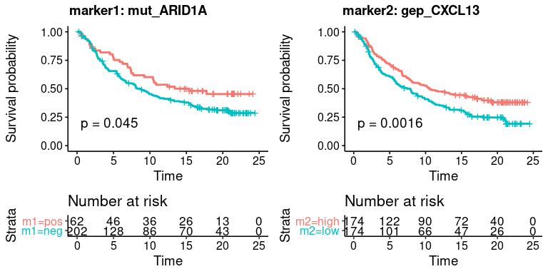
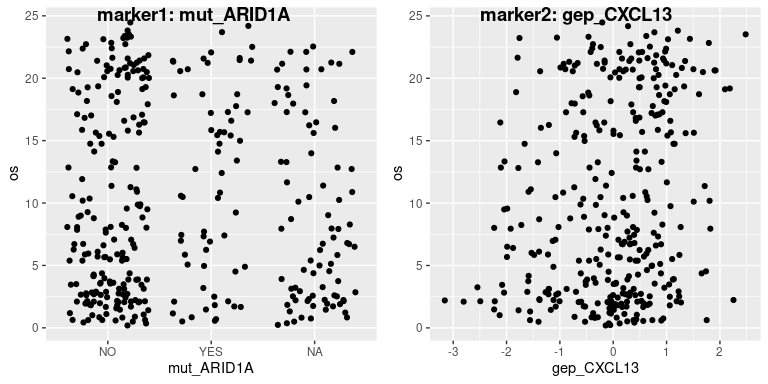
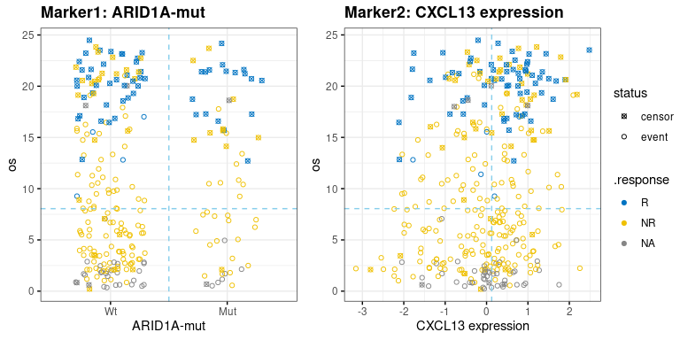
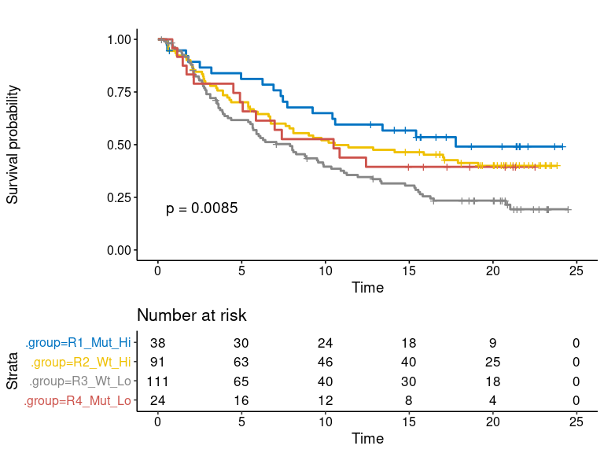
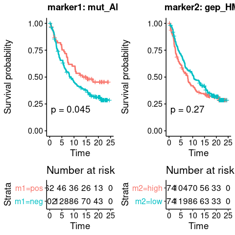
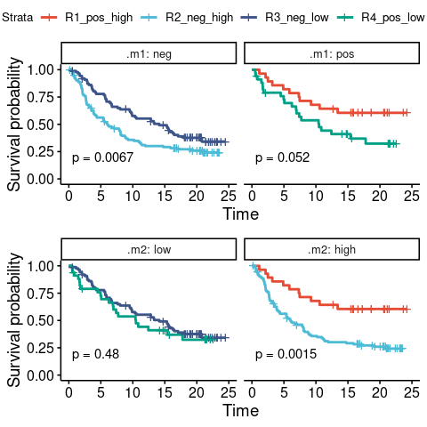
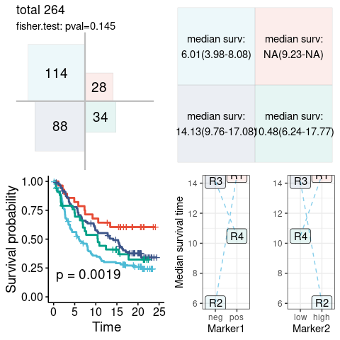

<!-- README.md is generated from README.Rmd. Please edit that file -->

# dualmarker

<!-- badges: start -->

<!-- badges: end -->

The goal of dualmarker is to analysis dual marker for response and
survival using logistic regression and cox model

## Installation

You can install the released version of dualmarker from github with:
devtools::install\_github(“maxiaopeng/dualmarker”)

## dataset

We demonstrate the data using Imvigor210 result.

## Example1

Here we demonstrated the visitation of TMB and TGFb signature for
response and survival analysis

plot1: single-markers

``` r
res.pair$plot$single.marker
```


plot2: Scatter-chart

``` r
res.pair$plot$scatter.chart
```


plot3: Four-quadrant response rate

``` r
res.pair$plot$response.4quad
```


plot4: ROC curve

``` r
res.pair$plot$roc
```


plot5: KMplot, not available plot6: four-quadrant show of survival

stats-1: four quadrant statistics

``` r
res.pair$stats$response.4quad$param
#> # A tibble: 1 x 7
#>   response    response.pos response.neg m1    m2         cutpoint.m1 cutpoint.m2
#>   <chr>       <chr>        <chr>        <chr> <chr>            <dbl>       <dbl>
#> 1 binaryResp… CR/PR        SD/PD        TMB   gepscore_…           8      -0.172
res.pair$stats$response.4quad$pos.n
#> R1 R2 R3 R4 
#> 16  3 15 27
res.pair$stats$response.4quad$total.n
#> R1 R2 R3 R4 
#> 41 68 62 63
res.pair$stats$response.4quad$stats.4quad
#> # A tibble: 4 x 9
#>   region .m1.level .m2.level n.total n.pos n.neg pct.pos pos.lower95 pos.upper95
#>   <chr>  <chr>     <chr>       <int> <int> <int>   <dbl>       <dbl>       <dbl>
#> 1 R1     pos       pos            41    16    25  0.390      0.242         0.555
#> 2 R2     neg       pos            68     3    65  0.0441     0.00919       0.124
#> 3 R3     neg       neg            62    15    47  0.242      0.142         0.367
#> 4 R4     pos       neg            63    27    36  0.429      0.305         0.560
```

stats-2: summary of logit

``` r
glimpse(res.pair$stats$logit)
#> Rows: 1
#> Columns: 36
#> $ response               <chr> "binaryResponse"
#> $ response.pos           <chr> "CR/PR"
#> $ response.neg           <chr> "SD/PD"
#> $ m1                     <chr> "TMB"
#> $ m2                     <chr> "gepscore_TGFb.19gene"
#> $ confound.factor        <chr> ""
#> $ cutpoint.m1            <lgl> NA
#> $ cutpoint.m2            <lgl> NA
#> $ m1.cat.pos             <chr> ""
#> $ m1.cat.neg             <chr> ""
#> $ m2.cat.pos             <chr> ""
#> $ m2.cat.neg             <chr> ""
#> $ m1_.m1_estimate        <dbl> 0.09963989
#> $ m1_.m1_p.value         <dbl> 1.395883e-06
#> $ m2_.m2_estimate        <dbl> -0.1199803
#> $ m2_.m2_p.value         <dbl> 0.02516686
#> $ md_.m1_estimate        <dbl> 0.09663392
#> $ md_.m1_p.value         <dbl> 2.582342e-06
#> $ md_.m2_estimate        <dbl> -0.08748326
#> $ md_.m2_p.value         <dbl> 0.135587
#> $ mdi_.m1_estimate       <dbl> 0.119926
#> $ mdi_.m1_p.value        <dbl> 1.162081e-06
#> $ mdi_.m2_estimate       <dbl> -0.2967303
#> $ mdi_.m2_p.value        <dbl> 0.003635338
#> $ `mdi_.m1:.m2_estimate` <dbl> 0.0182465
#> $ `mdi_.m1:.m2_p.value`  <dbl> 0.007925505
#> $ m1_AIC                 <dbl> 239.2481
#> $ m2_AIC                 <dbl> 267.3176
#> $ md_AIC                 <dbl> 238.98
#> $ mdi_AIC                <dbl> 233.9904
#> $ pval.m1.vs.null        <dbl> 7.993656e-09
#> $ pval.m2.vs.null        <dbl> 0.02249407
#> $ pval.m1.vs.md          <dbl> 0.1320594
#> $ pval.m2.vs.md          <dbl> 3.630161e-08
#> $ pval.m1.vs.mdi         <dbl> 0.009765815
#> $ pval.m2.vs.mdi         <dbl> 7.84323e-09
```

stats-3: summary of survival in each quadrant(not available here)
stats-4: summary of cox(not available here)

## Example2

Here we demonstrated the visualization of CXCL13 expression and ARID1A
mutation status

``` r
res.pair <- dm_pair(data = clin_bmk_IMvigor210, 
               response = "binaryResponse", response.pos = "CR/PR", response.neg = "SD/PD",
               time = "os", event = "censOS",
               marker1 = "mut_ARID1A", marker2 = "gep_CXCL13", 
               m1.cat.pos = "YES", m1.cat.neg = "NO")
#> Setting levels: control = 0, case = 1
#> Setting direction: controls < cases
#> Setting levels: control = 0, case = 1
#> Setting direction: controls < cases
#> Setting levels: control = 0, case = 1
#> Setting direction: controls < cases
#> Setting levels: control = 0, case = 1
#> Setting direction: controls < cases
```

plot1: single markers(not available here) plot2: scatter chart( not
available here) plot3: Four-quadrant response rate( not available here)
plot4: ROC curve( not available here) plot5: KMplot

``` r
res.pair$plot$survplot$km.m1m2
```



``` r
res.pair$plot$survplot$scatter.m1m2
```



``` r
res.pair$plot$survplot$km.dualmarker
```


``` r
res.pair$plot$survplot$km.dualmarker.facet
```



``` r
res.pair$plot$survplot$scatter.dualmarker
```


plot6: four-quadrant show of survival

``` r
res.pair$plot$surv.4quad
```



stats-1: four quadrant response(not available) stats-2: summary of logit
for response(not available) stats-3: summary of survival in each
quadrant

``` r
res.pair$stats$surv.4quad$param
#> # A tibble: 1 x 10
#>   time  event marker1 marker2 cutpoint.m1 m1.cat.pos m1.cat.neg cutpoint.m2
#>   <chr> <chr> <chr>   <chr>   <lgl>       <chr>      <chr>            <dbl>
#> 1 os    cens… mut_AR… gep_CX… NA          YES        NO               0.124
#> # … with 2 more variables: m2.cat.pos <chr>, m2.cat.neg <chr>
res.pair$stats$surv.4quad$stats
#> # A tibble: 4 x 8
#>   .quadrant .m1   .m2   records events median `0.95LCL` `0.95UCL`
#>   <fct>     <fct> <fct>   <dbl>  <dbl>  <dbl>     <dbl>     <dbl>
#> 1 R1        pos   high       38     18  17.8       9.23     NA   
#> 2 R2        neg   high       91     53  10.5       6.74     NA   
#> 3 R3        neg   low       111     82   7.89      5.52      9.86
#> 4 R4        pos   low        24     14  10.5       4.90     NA
```

stats-4: summary of cox

``` r
glimpse(res.pair$stats$cox)
#> Rows: 1
#> Columns: 35
#> $ time                   <chr> "os"
#> $ even                   <chr> "censOS"
#> $ m1                     <chr> "mut_ARID1A"
#> $ m2                     <chr> "gep_CXCL13"
#> $ confound.factor        <chr> ""
#> $ cutpoint_m1            <lgl> NA
#> $ cutpoint_m2            <lgl> NA
#> $ m1.cat.pos             <chr> "YES"
#> $ m1.cat.neg             <chr> "NO"
#> $ m2.cat.pos             <chr> ""
#> $ m2.cat.neg             <chr> ""
#> $ m1_.m1_estimate        <dbl> -0.3931839
#> $ m1_.m1_p.value         <dbl> 0.04572493
#> $ m2_.m2_estimate        <dbl> -0.2869317
#> $ m2_.m2_p.value         <dbl> 0.0001590714
#> $ md_.m1_estimate        <dbl> -0.3134224
#> $ md_.m1_p.value         <dbl> 0.1149989
#> $ md_.m2_estimate        <dbl> -0.2676217
#> $ md_.m2_p.value         <dbl> 0.0004277342
#> $ mdi_.m1_estimate       <dbl> -0.3045374
#> $ mdi_.m1_p.value        <dbl> 0.1233496
#> $ mdi_.m2_estimate       <dbl> -0.2463571
#> $ mdi_.m2_p.value        <dbl> 0.002164497
#> $ `mdi_.m1:.m2_estimate` <dbl> -0.1938994
#> $ `mdi_.m1:.m2_p.value`  <dbl> 0.4121259
#> $ m1_AIC                 <dbl> 1695.692
#> $ m2_AIC                 <dbl> 1686.086
#> $ md_AIC                 <dbl> 1685.451
#> $ mdi_AIC                <dbl> 1686.794
#> $ pval.m1.vs.null        <dbl> 0.03779216
#> $ pval.m2.vs.null        <dbl> 0.0001907733
#> $ pval.m1.vs.md          <dbl> 0.0004674887
#> $ pval.m2.vs.md          <dbl> 0.1044939
#> $ pval.m1.vs.mdi         <dbl> 0.001582535
#> $ pval.m2.vs.mdi         <dbl> 0.1928236
```

## Example3

find the candidate marker2 in gene signatures to combine with ARID1A
mutation, using ECOG, metastatistic-status as the confounding factor

``` r
m2.candidates <- str_subset(colnames(clin_bmk_IMvigor210),"gep_") 
res.m2.cox <- dm_searchM2_cox(
  data = clin_bmk_IMvigor210, 
   # survival
   time = "os", 
   event = "censOS",
   # marker1
   marker1 = "mut_ARID1A", 
   m1.binarize = T, 
   m1.cat.pos = "YES", 
   m1.cat.neg = "NO", 
   # marker2
   m2.candidates = m2.candidates
  )
```

Plot the searchM2 result, the top20 most significant marker2 will be
shown

``` r
plot.m2.cox <- dm_searchM2_topPlot(res.m2.cox, top.n = 30)
```

plot-1, ‘m2\_effect’ is dot-chart, showing the top significant marker2s,
whose introduction to dual-maker model(w/ or w/o interaction)
significantly increase the prediction of survival. Likelihood ratio
test(LRT) is carried out to compare dual-marker model and marker1 solo
model, the signed log10-pValue is shown on x-axis, and ‘sign’ indicates
the effect direction of marker2 to survival.

``` r
plot.m2.cox$m2_effect
```


plot-2: ‘interaction’ is dot-chart, showing the top significant
marker2s, which has statistical interaction with given marker1. Signed
log10-pValue is shown like ‘m2\_effect’

``` r
plot.m2.cox$interact
```


plot-3: ‘m1\_m2\_effect’ is scatter-plot, showing the log10-pValue of
model comparison, i.e. dual-vs-marker1 and dual-vs-marker2. Dual model
that superior to both marker1 and marker2 is preferred, located
top-right on the figure.

``` r
plot.m2.cox$m1_m2_effect
```


resulting table:

``` r
glimpse(res.m2.cox)
#> Rows: 1,268
#> Columns: 35
#> $ time                   <chr> "os", "os", "os", "os", "os", "os", "os", "os"…
#> $ even                   <chr> "censOS", "censOS", "censOS", "censOS", "censO…
#> $ m1                     <chr> "mut_ARID1A", "mut_ARID1A", "mut_ARID1A", "mut…
#> $ m2                     <chr> "gep_ADA", "gep_AKT3", "gep_CD24", "gep_BCL2L1…
#> $ confound.factor        <chr> "", "", "", "", "", "", "", "", "", "", "", ""…
#> $ cutpoint_m1            <lgl> NA, NA, NA, NA, NA, NA, NA, NA, NA, NA, NA, NA…
#> $ cutpoint_m2            <lgl> NA, NA, NA, NA, NA, NA, NA, NA, NA, NA, NA, NA…
#> $ m1.cat.pos             <chr> "YES", "YES", "YES", "YES", "YES", "YES", "YES…
#> $ m1.cat.neg             <chr> "NO", "NO", "NO", "NO", "NO", "NO", "NO", "NO"…
#> $ m2.cat.pos             <chr> "", "", "", "", "", "", "", "", "", "", "", ""…
#> $ m2.cat.neg             <chr> "", "", "", "", "", "", "", "", "", "", "", ""…
#> $ m1_.m1_estimate        <dbl> -0.3931839, -0.3931839, -0.3931839, -0.3931839…
#> $ m1_.m1_p.value         <dbl> 0.04572493, 0.04572493, 0.04572493, 0.04572493…
#> $ m2_.m2_estimate        <dbl> 0.020472278, -0.088602489, -0.040055394, -0.11…
#> $ m2_.m2_p.value         <dbl> 0.7921732808, 0.2316870325, 0.5845798870, 0.13…
#> $ md_.m1_estimate        <dbl> -0.3925669, -0.3902232, -0.3992445, -0.3964988…
#> $ md_.m1_p.value         <dbl> 0.04608730, 0.04740445, 0.04273637, 0.04396925…
#> $ md_.m2_estimate        <dbl> 0.018169157, -0.086696989, -0.048006083, -0.11…
#> $ md_.m2_p.value         <dbl> 0.815536324, 0.243180093, 0.514144401, 0.13210…
#> $ mdi_.m1_estimate       <dbl> -0.4642526, -0.3999853, -0.4101674, -0.3948740…
#> $ mdi_.m1_p.value        <dbl> 0.02572344, 0.04411029, 0.03869969, 0.04542806…
#> $ mdi_.m2_estimate       <dbl> 0.094208982, -0.069846691, -0.092351419, -0.15…
#> $ mdi_.m2_p.value        <dbl> 0.284405899, 0.402004262, 0.263768116, 0.07853…
#> $ `mdi_.m1:.m2_estimate` <dbl> -0.37225167, -0.08245620, 0.22222076, 0.175550…
#> $ `mdi_.m1:.m2_p.value`  <dbl> 0.05473952, 0.65399403, 0.23758675, 0.35539251…
#> $ m1_AIC                 <dbl> 1695.692, 1695.692, 1695.692, 1695.692, 1695.6…
#> $ m2_AIC                 <dbl> 1699.937, 1698.583, 1699.707, 1697.803, 1697.6…
#> $ md_AIC                 <dbl> 1697.637, 1696.336, 1697.266, 1695.415, 1695.9…
#> $ mdi_AIC                <dbl> 1695.951, 1698.136, 1697.843, 1696.573, 1697.7…
#> $ pval.m1.vs.null        <dbl> 0.03779216, 0.03779216, 0.03779216, 0.03779216…
#> $ pval.m2.vs.null        <dbl> 0.792048437, 0.232822940, 0.584731219, 0.13776…
#> $ pval.m1.vs.md          <dbl> 0.815428198, 0.244342092, 0.514221058, 0.13133…
#> $ pval.m2.vs.md          <dbl> 0.03812741, 0.03933856, 0.03508215, 0.03618768…
#> $ pval.m1.vs.mdi         <dbl> 0.154071909, 0.459326828, 0.396740154, 0.21028…
#> $ pval.m2.vs.mdi         <dbl> 0.01844880, 0.10824010, 0.05327299, 0.07316198…
```

## Example 4

``` r
res.pair <- dm_pair(data = clin_bmk_IMvigor210, 
               time = "os", event = "censOS",
               response = "binaryResponse", response.pos = "CR/PR", response.neg = "SD/PD",
               marker1 = "mut_ARID1A", marker2 = "gep_HMGB1", 
               m1.cat.pos = "YES", m1.cat.neg = "NO")
#> Setting levels: control = 0, case = 1
#> Setting direction: controls < cases
#> Setting levels: control = 0, case = 1
#> Setting direction: controls < cases
#> Setting levels: control = 0, case = 1
#> Setting direction: controls < cases
#> Setting levels: control = 0, case = 1
#> Setting direction: controls < cases
```

``` r
res.pair$plot
#> $single.marker
```


    #> 
    #> $scatter.chart


    #> 
    #> $response.4quad


    #> 
    #> $roc


    #> 
    #> $survplot
    #> $survplot$km.m1m2



    #> 
    #> $survplot$scatter.m1m2


    #> 
    #> $survplot$km.dualmarker


    #> 
    #> $survplot$km.dualmarker.facet



    #> 
    #> $survplot$scatter.dualmarker


    #> 
    #> 
    #> $surv.4quad


