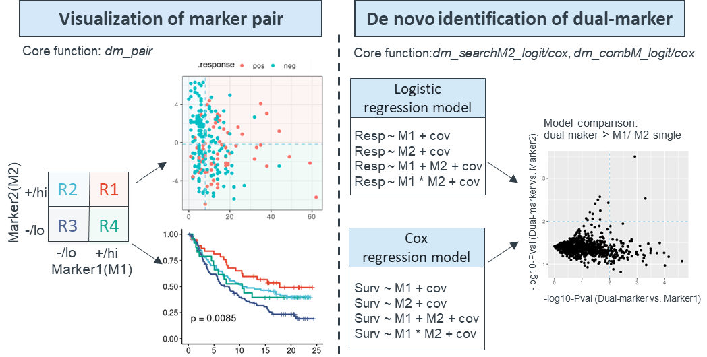
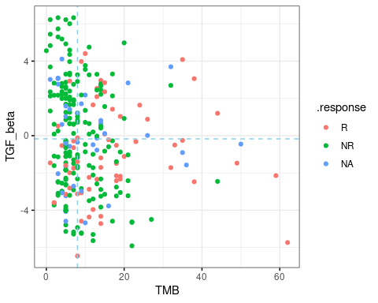
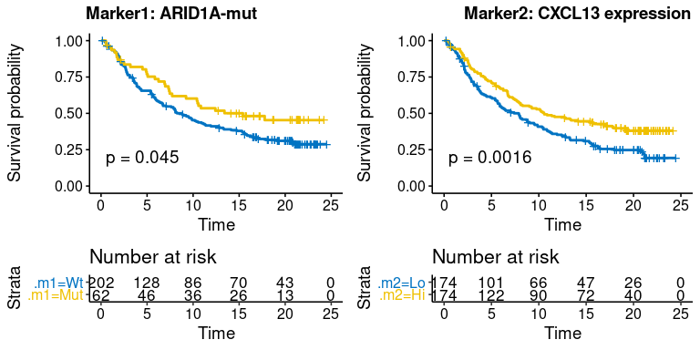

<!-- README.md is generated from README.Rmd. Please edit that file -->

# dualmarker

<!-- badges: start -->

<!-- badges: end -->

*Dualmarker* is designed for data exploration and hypothesis generation
for dual biomarkers. It provides intuitive visualizations and extensive
assessment of two marker combinations using logistic regression model
for binary outcome (response analysis) and Cox regression for
time-to-event outcome (survival analysis). It performs dual marker
analysis via two distinct modules, one for evaluation of specific
biomarker pair through *dm\_pair* function, which comprehensively
reveals the correlation among two markers, response and survival using
over 14 sub-plots,such as boxplots, scatterplots, ROCs, and Kaplan-Meier
plots. Another module is de-novo identification and prioritization of
marker2 among candidate markers in combination with known marker1 to
predict response and survival through *dm\_searchM2\_cox* and
*dm\_searchM2\_logit* function, its expansion version works for all
biomarker combination to prioritize the most significant pair through
*dm\_combM\_cox* and *dm\_combM\_logit* function. It is applicable for
both response and survival analyses and compatible with both continuous
and categorical variables. This figure illustrates the framework of this
package.



## Installation

  - Install the latest developmental version from
    [GitHub](https://github.com/maxiaopeng/dualmarker) as follow:

<!-- end list -->

``` r
if(!require(devtools)) install.packages("devtools")
devtools::install_github("maxiaopeng/dualmarker")
```

## Key functions

Plenty of commands and functions are wrapped into five main functions:
*dm\_pair* for visualization and statistics of given dual marker pairs,
*dm\_searchM2\_cox* and *dm\_searchM2\_logit* for de novo identification
of novel marker2 to combine with marker1 using Cox survival model and
logistic regression model.

### *dm\_pair*

*dm\_pair* is the main function for dual marker visualization and
statistics. It takes the marker1, marker2, response or survival as
input, and returns plots (response.plot, survival.plot) and statistic
results (response.stats, survival.stats) from logistic regression for
binary outcome(response) and Cox regression for time-to-event
outcome(survival) . The detailed results are shown in the following
structure:

  - response.plot
      - boxplot
      - scatter.chart
      - four.quadrant
      - roc
  - response.stats
      - logit
      - four.quadrant
          - param
          - stats
  - survival.plot
      - km.m1m2
      - scatter.m1m2
      - km.dualmarker
      - km.dualmarker.facet
      - scatter.dualmarker
      - four.quadrant
  - survival.stats
      - cox
      - four.quadrant
          - param
          - stats

the overview plot:


### *dm\_searchM2\_cox/logit*

These two functions are the main functions for do novo identification of
marker2 to combine with marker1. It takes marker1, and m2.candidates,
optional covariates, response or time/event as input and returns the
statistical result of Cox or logistic regression model. Four regression
models are built using single marker and dual marker w/ or w/o
interaction term, as follows:

  - model1: Surv/Resp \~ marker1 + covariates, labeled as ‘SM1’ for
    short
  - model2: Surv/Resp \~ marker2 + covariates , labeled as ‘SM2’ for
    short
  - model3: Surv/Resp \~ marker1 + marker2 + covariates, labeled as ‘DM’
    for short, i.e. dual-marker
  - model4: Surv/Resp \~ marker1 \* marker2 (with interaction term) +
    covariates, labeled as ‘DMI’ for short, i.e. dual-marker with
    interaction

Model comparison is performed to test the difference of dual-marker
model and single-marker model by Likihood ratio test(LRT) using *anova*
function for SM1-vs-DM, SM1-vs-DMI, SM2-vs-DM, SM2-vs-DMI.
*dm\_searchM2\_topPlot* can facilitate the glance of top candidate
marker2s for both logistic and cox regression model.

The statistics of logistic regression contains the basic information of
marker1, marker2, covariates, response, time, event; the estimate and
p-values from 4 models, AUC(for logistic regression)/ concordant
probability CPE(for Cox regression), AIC, p-values of model comparisons.
Here is an example of logistic regression:

| colnames             | example values | description                          |
| -------------------- | -------------- | ------------------------------------ |
| response             | binaryResponse | response variable                    |
| response\_pos        | CR, PR         | positive response                    |
| response\_neg        | SD, PD         | negative response                    |
| m1                   | TMB            | marker1 variable                     |
| m2                   | gepscore\_TGFb | marker2 variable                     |
| covariates           | ""             | covariates variable                  |
| cutpoint\_m1         | NA             | cutpoint if m1 is numeric            |
| cutpoint\_m2         | NA             | cutpoint if m2 is numeric            |
| m1\_cat\_pos         | ""             | positive values if m1 is categorical |
| m1\_cat\_neg         | ""             | negative values if m1 is categorical |
| m2\_cat\_pos         | ""             | positive values if m2 is categorical |
| m2\_cat\_neg         | ""             | negative values if m2 is categorical |
| SM1\_m1\_estimate    | 0.09963989     | estimate of marker1 in SM1 model     |
| SM1\_m1\_p.value     | 1.395883e-06   | pvalue of marker1 in SM1 model       |
| SM2\_m2\_estimate    | \-0.1199803    | estimate of marker2 in SM2 model     |
| SM2\_m2\_p.value     | 0.02516686     | pvalue of marker2 in SM2 model       |
| DM\_m1\_estimate     | 0.09663392     | estimate of marker1 in DM model      |
| DM\_m1\_p.value      | 2.582342e-06   | pvalue of marker1 in DM model        |
| DM\_m2\_estimate     | \-0.08748326   | estimate of marker2 in DM model      |
| DM\_m2\_p.value      | 0.135587       | pvalue of marker2 in DM model        |
| DMI\_m1\_estimate    | 0.119926       | estimate of marker1 in DMI model     |
| DMI\_m1\_p.value     | 1.162081e-06   | pvalue of marker1 in DMI model       |
| DMI\_m2\_estimate    | \-0.2967303    | estimate of marker2 in DMI model     |
| DMI\_m2\_p.value     | 0.003635338    | pvalue of marker2 in DMI model       |
| DMI\_m1:m2\_estimate | 0.0182465      | estimate of interaction m1:m2        |
| DMI\_m1:m2\_p.value  | 0.007925505    | pvalue of interaction m1:m2          |
| SM1\_auc             | 0.728          | AUC of SM1 model                     |
| SM2\_auc             | 0.591          | AUC of SM2 model                     |
| DM\_auc              | 0.747          | AUC of DM model                      |
| DMI\_auc             | 0.754          | AUC of DMI model                     |
| SM1\_AIC             | 239.2481       | AIC of SM1 model                     |
| SM2\_AIC             | 267.3176       | AIC of SM2 model                     |
| DM\_AIC              | 238.98         | AIC of DM model                      |
| DMI\_AIC             | 233.9904       | AIC of DMI model                     |
| pval\_SM1\_vs\_NULL  | 7.993656e-09   | pvalue of SM1-vs-NULL model          |
| pval\_SM2\_vs\_NULL  | 0.02249407     | pvalue of SM2-vs-NULL model          |
| pval\_SM1\_vs\_DM    | 0.1320594      | pvalue of SM1-vs-DM model            |
| pval\_SM2\_vs\_DM    | 3.630161e-08   | pvalue of SM2-vs-DM model            |
| pval\_SM1\_vs\_DMI   | 0.009765815    | pvalue of SM1-vs-DMI model           |
| pval\_SM2\_vs\_DMI   | 7.84323e-09    | pvalue of SM2-vs-DMI model           |

## dataset

We demonstrate the package using
[Imvigor210](http://research-pub.gene.com/IMvigor210CoreBiologies)
biomarker data. This dataset includes the baseline characterization of
PDL1 IHC, gene expression profiling(GEP) and mutations on 348 advanced
UC patients as well as response and Overall survival(OS) data treated by
Atezolizumab. The demographic info, clinical efficacy and biomarker data
is stored in **clin\_bmk\_IMvigor210** dataframe, with gene expression
variables containing ‘gep\_’ prefix, gene signature score variables
containing ‘gepscore\_’ prefix and mutation variables containing ‘mut\_’
prefix. The GEP data and gene signature score is processed according to
the IMvigor210CoreBiologies package and gene signature score is
calculated using *hallmark* genesets from MsigDBv7.0 as well as
signatures from the IMvigor210CoreBiologies package. The data is
confirmed with the original publication.

``` r
library(dualmarker)
library(stringr)
library(dplyr)
```

## Example1: marker pair of TMB + TGF-beta signature

Here we demonstrate the response analysis of TMB + TGF-beta gene
signature(gepscore\_TGFb.19gene) using *dm\_pair* function. This pair of
biomarker is studied in [Nature.2018
Feb 22;554(7693):544-548](https://pubmed.ncbi.nlm.nih.gov/29443960/).
The *response* should be dichotomous by setting *response.pos* and
*response.neg* values.

``` r
res.pair <- dm_pair(
   data = clin_bmk_IMvigor210, 
   # response info
   response = "binaryResponse", 
   response.pos = "CR/PR", 
   response.neg = "SD/PD", 
   label.response.pos = "R",
   label.response.neg = "NR",
   # marker1
   marker1 = "TMB", 
   m1.num.cut = "median",  # default median cut for continuous variable
   label.m1 = "TMB",
   label.m1.pos = "TMB_hi",
   label.m1.neg = "TMB_lo",
   # marker2
   marker2 = "gepscore_TGFb.19gene", 
   m2.num.cut = "median", 
   label.m2 = "TGF_beta", 
   label.m2.pos = "TGFb_hi",
   label.m2.neg = "TGFb_lo",
   # others
   na.rm.response = F, # show NA for response variable
   na.rm.marker = F,  # show NA from marker variable
   # palette
   palette.4quadrant = "default", 
   palette.other = "default"
)
```

  - plot-1: \[response analysis\] Single marker  
    The correlation between single marker and response is shown in
    boxplot, and p-value of Wilcoxon test between positive and negative
    response is added to the plot.

<!-- end list -->

``` r
res.pair$response.plot$boxplot
```

<!-- -->

  - plot-2: \[response analysis\] Scatter chart  
    The correlation between marker1, maker2 and response is shown in
    scatter-chart. If marker1 and/or marker2 is categorical, the jitter
    plot will be shown with color indicating response status.

<!-- end list -->

``` r
res.pair$response.plot$scatter.chart
```

<!-- -->

  - plot-3: \[response analysis\] Four-quadrant chart  
    Samples are split into four groups/quadrants, according to cutoffs
    for continuous markers, default using ‘median’. The independence of
    each quadrant is tested by Fisher exact test. Response rate, sample
    size and confidence interval are shown in matrix, doughnut chart and
    line chart. For the doughnut chart, response rate is corresponding
    to red arc fraction and sample size to width of ring, and the line
    chart reveals the response rate and potential statistical
    interaction for two markers if lines are crossed.

<!-- end list -->

``` r
res.pair$response.plot$four.quadrant
```

<!-- -->

  - plot-4: \[response analysis\] ROC curve  
    The single and dual marker prediction of response is also shown on
    ROC curve. Logistics regression model is applied w/ or w/o
    interaction term between two biomarkers. AUC value and its
    confidence interval is also drawn on the graph.

<!-- end list -->

``` r
res.pair$response.plot$roc
```

<!-- -->

  - plot-5: \[survival analysis\] survival plot of dual marker  
    not available here, see Example2

  - plot-6: \[survival analysis\] survival plot of dual marker  
    not available here, see Example2

  - plot-7: \[survival analysis\] Four-quadrant chart  
    not available here, see Example2

  - stats-1: \[response analysis\] Four-quadrant statistics  
    *\(response.stats\)four.quadrant* contains four-quadrant statistics
    of response

  - *param* contains the note of marker1,marker2, cutoff methods et al

  - *stats* contains the sample number, response rate and its confidence
    interval in each quadrant, R1-R4

<!-- end list -->

``` r
res.4q <- res.pair$response.stats$four.quadrant
res.4q$param
#> # A tibble: 1 x 7
#>   response    response.pos response.neg m1    m2         cutpoint.m1 cutpoint.m2
#>   <chr>       <chr>        <chr>        <chr> <chr>            <dbl>       <dbl>
#> 1 binaryResp… CR/PR        SD/PD        TMB   gepscore_…           8      -0.172
res.4q$stats
#> # A tibble: 4 x 9
#>   region .m1.level .m2.level n.total n.pos n.neg pct.pos pos.lower95 pos.upper95
#>   <chr>  <chr>     <chr>       <int> <int> <int>   <dbl>       <dbl>       <dbl>
#> 1 R1     pos       pos            41    16    25  0.390      0.242         0.555
#> 2 R2     neg       pos            68     3    65  0.0441     0.00919       0.124
#> 3 R3     neg       neg            62    15    47  0.242      0.142         0.367
#> 4 R4     pos       neg            63    27    36  0.429      0.305         0.560
```

  - stats-2: \[response analysis\] Logistic regression result  
    Four logistic regression models are built, and model comparison is
    performed to test the difference of dual-marker model and
    single-marker model by Likelihood ratio test(LRT) using *anova*
    function for model3-vs-model1, model4-vs-model1, model3-vs-model2,
    model4-vs-model2.

  - model1: Resp \~ marker1 + covariates, labeled as ‘M1’ for short

  - model2: Resp \~ marker2 + covariates, labeled as ‘M2’ for short

  - model3: Resp \~ marker1 + marker2 + covariates, labeled as ‘MD’ for
    short, i.e. dual-marker

  - model4: Resp \~ marker1 \* marker2 + covariates (with interaction
    term), labeled as ‘MDI’ for short, i.e. dual-marker with interaction

Logistic regression models return the following information 1. basic
information: response, m1(marker1), m2(marker2), cut point for
continuous m1/m2, positive/negative values for categorical m1/2 2.
logistic regression parameters: estimate(weight) and p-value(Wald test)
of each predictive variable in model1(SM1), model2(SM2), model3(DM),
model4(DMI). ‘MDI\_.m1:.m2\_estimate’ and ‘MDI\_m1:m2\_pval’ is estimate
and p-value of the interaction term of marker1 and marker2. 3. AIC: AIC
of model SM1,SM2,DM and DMI 4. model comparison: p-value of Likelihood
Ratio Test(LRT) for SM1-vs-NULL(null model, no marker), SM2-vs-NULL,
SM1-vs-DM, SM2-vs-DM, SM1-vs-DMI, SM2-vs-DMI

``` r
dplyr::glimpse(res.pair$response.stats$logit)
#> Rows: 1
#> Columns: 40
#> $ response             <chr> "binaryResponse"
#> $ response_pos         <chr> "CR/PR"
#> $ response_neg         <chr> "SD/PD"
#> $ m1                   <chr> "TMB"
#> $ m2                   <chr> "gepscore_TGFb.19gene"
#> $ covariates           <chr> ""
#> $ cutpoint_m1          <lgl> NA
#> $ cutpoint_m2          <lgl> NA
#> $ m1_cat_pos           <chr> ""
#> $ m1_cat_neg           <chr> ""
#> $ m2_cat_pos           <chr> ""
#> $ m2_cat_neg           <chr> ""
#> $ SM1_m1_estimate      <dbl> 0.09963989
#> $ SM1_m1_p.value       <dbl> 1.395883e-06
#> $ SM2_m2_estimate      <dbl> -0.1199803
#> $ SM2_m2_p.value       <dbl> 0.02516686
#> $ DM_m1_estimate       <dbl> 0.09663392
#> $ DM_m1_p.value        <dbl> 2.582342e-06
#> $ DM_m2_estimate       <dbl> -0.08748326
#> $ DM_m2_p.value        <dbl> 0.135587
#> $ DMI_m1_estimate      <dbl> 0.119926
#> $ DMI_m1_p.value       <dbl> 1.162081e-06
#> $ DMI_m2_estimate      <dbl> -0.2967303
#> $ DMI_m2_p.value       <dbl> 0.003635338
#> $ `DMI_m1:m2_estimate` <dbl> 0.0182465
#> $ `DMI_m1:m2_p.value`  <dbl> 0.007925505
#> $ SM1_auc              <dbl> 0.728
#> $ SM2_auc              <dbl> 0.591
#> $ DM_auc               <dbl> 0.747
#> $ DMI_auc              <dbl> 0.754
#> $ SM1_AIC              <dbl> 239.2481
#> $ SM2_AIC              <dbl> 267.3176
#> $ DM_AIC               <dbl> 238.98
#> $ DMI_AIC              <dbl> 233.9904
#> $ pval_SM1_vs_NULL     <dbl> 7.993656e-09
#> $ pval_SM2_vs_NULL     <dbl> 0.02249407
#> $ pval_SM1_vs_DM       <dbl> 0.1320594
#> $ pval_SM2_vs_DM       <dbl> 3.630161e-08
#> $ pval_SM1_vs_DMI      <dbl> 0.009765815
#> $ pval_SM2_vs_DMI      <dbl> 7.84323e-09
```

  - stats-3: \[survival analysis\] Four-quadrant statistics  
    not available here, see Example2

  - stats-4: \[survival analysis\] Cox regression result  
    not available here, see Example2

## Example2: marker pair of ARID1A mutation + CXCL13 expression

Here we demonstrated the visualization of CXCL13 expression and ARID1A
mutation , this biomarker pair is studied by [Sci Transl Med. 2020
Jun 17;12(548):eabc4220](https://pubmed.ncbi.nlm.nih.gov/32554706/), we
showed the same result here.

``` r
res.pair <- dm_pair(
   data = clin_bmk_IMvigor210, 
   # response (optional)
   response = "binaryResponse",
   response.pos = "CR/PR", 
   response.neg = "SD/PD",
   label.response.pos = "R", 
   label.response.neg = "NR",
   # survival info
   time = "os", 
   event = "censOS",
   # marker1
   marker1 = "mut_ARID1A",  
   label.m1 = "ARID1A-mut",
   m1.cat.pos = "YES", 
   m1.cat.neg = "NO",
   label.m1.pos = "Mut", 
   label.m1.neg = "Wt",
   # marker2
   marker2 = "gep_CXCL13",
   m2.num.cut = "median", 
   label.m2 = "CXCL13 expression",
   label.m2.pos = "Hi", 
   label.m2.neg = "Lo",
   # palette
   palette.4quadrant = "jco",
   palette.other = "jco", 
   # others
   na.rm.response = T, # donot show NA in response variable
   na.rm.marker = T # donot show NA in biomarker variable: mut_ARID1A & gep_CXCL13
)
```

  - plot-1: \[response analysis\] Single marker  
    Not shown here, see Example1

  - plot-2: \[response analysis\] Scatter chart  
    Not shown here, see Example1

  - plot-3: \[response analysis\] Four-quadrant chart  
    Not shown here, see Example1

  - plot-4: \[response analysis\] ROC curve  
    Not shown here, see Example1

  - plot-5: \[survival analysis\] survival plot of single marker
    
      - *survival.plot$km.m1m1*: KMplot of marker1 and marker2 on two
        parallel sub-plots
      - *survival.plot$scatter.m1m2*: scatter-plot of survival
        time(y-axis) and marker1/marker2(x-axis) on two parallel
        sub-plots, response status(if provided) is shown as color.

<!-- end list -->

``` r
res.pair$survival.plot$km.m1m2
```

<!-- -->

``` r
res.pair$survival.plot$scatter.m1m2
```

<!-- -->

  - plot-6: \[survival analysis\] survival plot of dual marker
    
      - *km.dualmarker*: KMplot of dual marker, corresponding to four
        quadrants in the scatter plot scenario.
      - *km.dualmarker.facet*: conditional KMplot of dual marker. The
        conditional KMplot represents the survival curve of marker1 on
        condition of marker2-level (+/hi or -/lo), and marker2 on
        condition of marker1 level. It reveals the correlation between
        survival and marker1 on the context of marker2 level and vice
        verse.
      - *scatter.dualmarker*: scatter-plot of marker1 and marker2 with
        survival time shown as the size of dot and response (if
        provided) as color

<!-- end list -->

``` r
res.pair$survival.plot$km.dualmarker
```

<!-- -->

``` r
res.pair$survival.plot$km.dualmarker.facet
```

<!-- -->

``` r
res.pair$survival.plot$scatter.dualmarker
```

<!-- -->

  - plot-7: \[survival analysis\] Four-quadrant chart  
    Like response analysis, four-quadrant plots for survival also
    contains 4 sub-figures.

<!-- end list -->

1.  Area proportion chart shows the sample size in each quadrant, this
    chart may be different from counterpart in response analysis owning
    to samples with missing data of survival and response.
2.  Statistic matrix: median survival time and confidence interval
3.  KMplot of four quadrants
4.  Line chart of median survival time for each quadrant

<!-- end list -->

``` r
res.pair$survival.plot$four.quadrant
```

<!-- -->

  - stats-1: \[response analysis\] Four-quadrant statistics  
    not shown here, see Example1

  - stats-2: \[response analysis\] Logistic regression results  
    not shown here, see Example1

  - stats-3: \[survival analysis\] Four-quadrant statistics  
    *\(survival.stats\)four.quadrant* contains four-quadrant statistics
    of survival

  - *param* contains the note of marker1,marker2, cutoff methods et al.

  - *stats* contains the sample number, median survival and confidence
    interval in each quadrant, R1-R4

<!-- end list -->

``` r
stats.4q <- res.pair$survival.stats$four.quadrant
stats.4q$param
#> # A tibble: 1 x 10
#>   time  event marker1 marker2 cutpoint.m1 m1.cat.pos m1.cat.neg cutpoint.m2
#>   <chr> <chr> <chr>   <chr>   <lgl>       <chr>      <chr>            <dbl>
#> 1 os    cens… mut_AR… gep_CX… NA          YES        NO               0.124
#> # … with 2 more variables: m2.cat.pos <chr>, m2.cat.neg <chr>
stats.4q$stats
#> # A tibble: 4 x 8
#>   .quadrant .m1   .m2   records events median `0.95LCL` `0.95UCL`
#>   <fct>     <fct> <fct>   <dbl>  <dbl>  <dbl>     <dbl>     <dbl>
#> 1 R1        Mut   Hi         38     18  17.8       9.23     NA   
#> 2 R2        Wt    Hi         91     53  10.5       6.74     NA   
#> 3 R3        Wt    Lo        111     82   7.89      5.52      9.86
#> 4 R4        Mut   Lo         24     14  10.5       4.90     NA
```

  - stats-4: \[survival analysis\] Cox regression result  
    Very similar to response analysis, four cox regression models are
    built, and model comparison is performed to test the difference of
    dual-marker model and single-marker model by Likihood ratio
    test(LRT) using *anova* function for model3-vs-model1,
    model4-vs-model1, model3-vs-model2, model4-vs-model2.

  - model1: Surv \~ marker1 + covariates, labeled as ‘SM1’ for short

  - model2: Surv \~ marker2 + covariates, labeled as ‘SM2’ for short

  - model3: Surv \~ marker1 + marker2 + covariates, labeled as ‘DM’ for
    short, i.e. dual-marker

  - model4: Surv \~ marker1 \* marker2 + covariates (with interaction
    term), labeled as ‘DMI’ for short, i.e. dual-marker with interaction

Cox regression models return the following results:  
1\. basic parameters: time, event, m1(marker1), m2(marker2), cut point
for continuous m1/m2, positive/negative values for categorical m1/2 2.
Cox regression parameters: estimate(weight) and p-value(Wald test) of
each predictive variable in model1(SM1), model2(SM2), model3(DM),
model4(DMI). ‘DMI\_m1:m2\_estimate’ and ‘DMI\_m1:m2\_pval’ is estimate
and p-value of the interaction term of marker1 and marker2. 3. AIC: AIC
of model SM1, SM2, DM, DMI 4. CPE: concordant probability to evaluate
the performance of Cox model using CPE package for SM1, SM2, DM, DMI 5.
model comparison: p-value of LRT for M1.vs.null(R \~ 1, no marker),
M2.vs.null, M1.vs.MD, M2.vs.MD, M1.vs.MDI, M2.vs.MDI

``` r
dplyr::glimpse(res.pair$survival.stats$cox)
#> Rows: 1
#> Columns: 39
#> $ time                 <chr> "os"
#> $ even                 <chr> "censOS"
#> $ m1                   <chr> "mut_ARID1A"
#> $ m2                   <chr> "gep_CXCL13"
#> $ covariates           <chr> ""
#> $ cutpoint_m1          <lgl> NA
#> $ cutpoint_m2          <lgl> NA
#> $ m1_cat_pos           <chr> "YES"
#> $ m1_cat_neg           <chr> "NO"
#> $ m2_cat_pos           <chr> ""
#> $ m2_cat_neg           <chr> ""
#> $ SM1_m1_estimate      <dbl> -0.3931839
#> $ SM1_m1_p.value       <dbl> 0.04572493
#> $ SM2_m2_estimate      <dbl> -0.2869317
#> $ SM2_m2_p.value       <dbl> 0.0001590714
#> $ DM_m1_estimate       <dbl> -0.3134224
#> $ DM_m1_p.value        <dbl> 0.1149989
#> $ DM_m2_estimate       <dbl> -0.2676217
#> $ DM_m2_p.value        <dbl> 0.0004277342
#> $ DMI_m1_estimate      <dbl> -0.3045374
#> $ DMI_m1_p.value       <dbl> 0.1233496
#> $ DMI_m2_estimate      <dbl> -0.2463571
#> $ DMI_m2_p.value       <dbl> 0.002164497
#> $ `DMI_m1:m2_estimate` <dbl> -0.1938994
#> $ `DMI_m1:m2_p.value`  <dbl> 0.4121259
#> $ SM1_AIC              <dbl> 1695.692
#> $ SM2_AIC              <dbl> 1686.086
#> $ DM_AIC               <dbl> 1685.451
#> $ DMI_AIC              <dbl> 1686.794
#> $ SM1_CPE              <dbl> 0.535011
#> $ SM2_CPE              <dbl> 0.5757988
#> $ DM_CPE               <dbl> 0.5834954
#> $ DMI_CPE              <dbl> 0.587801
#> $ pval_SM1_vs_NULL     <dbl> 0.03779216
#> $ pval_SM2_vs_NULL     <dbl> 0.0001907733
#> $ pval_SM1_vs_DM       <dbl> 0.0004674887
#> $ pval_SM2_vs_DM       <dbl> 0.1044939
#> $ pval_SM1_vs_DMI      <dbl> 0.001582535
#> $ pval_SM2_vs_DMI      <dbl> 0.1928236
```

## Example3: search GEP candidates marker2 to combine with mut\_ARID1A for survival analysis

Search among gene expression candidate to combine with ARID1A mutation
using *dm\_searchM2\_cox*

``` r
m2.candidates <- stringr::str_subset(colnames(clin_bmk_IMvigor210),"gep_")
res.m2.cox <- dm_searchM2_cox(
   data = clin_bmk_IMvigor210, 
   # survival
   time = "os", 
   event = "censOS",
   # marker1
   marker1 = "mut_ARID1A", 
   m1.binarize = T, 
   m1.cat.pos = "YES", 
   m1.cat.neg = "NO", 
   # marker2
   m2.candidates = m2.candidates, 
   m2.binarize = F, # as continuous variables
   p.adjust.method = "BH"
)
```

Glance of the top candidates gene  
*dm\_searchM2\_topPlot* takes the result of either *dm\_searchM2\_cox*
or *dm\_searchM2\_logit* as input, and returns 3 figures. +
*\(m2_effect* dot-chart showing top significant marker2s using model comparison dual-vs-marker1 + *\)interact*
dot-chart showing top significant marker2s having statistical
interaction with marker1 + *$m1\_m2\_effect* scatter-plot showing
log10-p-value of all marker2s in model comparison of dual-vs-marker1 and
dual-vs-marker2

``` r
plot.m2.cox <- dm_searchM2_topPlot(res.m2.cox, top.n = 20, 
                                   show.padj = F, palette = "jco")
```

  - plot-1: marker2 effect  
    ‘m2\_effect’ is dot-chart, showing the top significant marker2s,
    whose introduction to dual-maker model(w/ or w/o interaction)
    significantly increase the prediction of survival or response.
    Likelihood ratio test(LRT) is carried out to compare dual-marker
    model and marker1 solo model, the signed log10-pValue is shown on
    x-axis, and ‘sign’ indicates the effect direction of marker2(single
    marker) to survival. Genes with negative values on the left are
    positive survival predictors.

<!-- end list -->

``` r
plot.m2.cox$m2_effect
```

<!-- -->

  - plot-2: marker2’s interaction  
    ‘interaction’ is dot-chart, showing the top significant marker2s,
    which has statistical interaction with given marker1. Signed
    log10-pValue is shown like ‘m2\_effect’

<!-- end list -->

``` r
plot.m2.cox$interact
```

<!-- -->

  - plot-3: m1 and m2 effect  
    ‘m1\_m2\_effect’ is scatter-plot, showing the log10-pValue of model
    comparison, i.e. dual-vs-marker1 and dual-vs-marker2. Dual model
    that superior to both marker1 and marker2 is preferred, located
    top-right on the figure.

<!-- end list -->

``` r
plot.m2.cox$m1_m2_effect
```

<!-- -->

  - plot-4: CPE ‘CPE’ is concordant probability to evaluate the
    performance of Cox model using CPE package

<!-- end list -->

``` r
plot.m2.cox$CPE
```

<!-- -->

  - stats: cox result  
    this shows the same information with
    *res\_pair\(survival.stats\)cox* or
    *res\_pair\(response.stats\)logit*

<!-- end list -->

``` r
dplyr::glimpse(res.m2.cox)
#> Rows: 1,268
#> Columns: 52
#> $ time                 <chr> "os", "os", "os", "os", "os", "os", "os", "os", …
#> $ even                 <chr> "censOS", "censOS", "censOS", "censOS", "censOS"…
#> $ m1                   <chr> "mut_ARID1A", "mut_ARID1A", "mut_ARID1A", "mut_A…
#> $ m2                   <chr> "gep_ADA", "gep_AKT3", "gep_CD24", "gep_BCL2L11"…
#> $ covariates           <chr> "", "", "", "", "", "", "", "", "", "", "", "", …
#> $ cutpoint_m1          <lgl> NA, NA, NA, NA, NA, NA, NA, NA, NA, NA, NA, NA, …
#> $ cutpoint_m2          <lgl> NA, NA, NA, NA, NA, NA, NA, NA, NA, NA, NA, NA, …
#> $ m1_cat_pos           <chr> "YES", "YES", "YES", "YES", "YES", "YES", "YES",…
#> $ m1_cat_neg           <chr> "NO", "NO", "NO", "NO", "NO", "NO", "NO", "NO", …
#> $ m2_cat_pos           <chr> "", "", "", "", "", "", "", "", "", "", "", "", …
#> $ m2_cat_neg           <chr> "", "", "", "", "", "", "", "", "", "", "", "", …
#> $ SM1_m1_estimate      <dbl> -0.3931839, -0.3931839, -0.3931839, -0.3931839, …
#> $ SM1_m1_p.value       <dbl> 0.04572493, 0.04572493, 0.04572493, 0.04572493, …
#> $ SM1_m1_p.adj         <dbl> 0.04572493, 0.04572493, 0.04572493, 0.04572493, …
#> $ SM2_m2_estimate      <dbl> 0.020472278, -0.088602489, -0.040055394, -0.1144…
#> $ SM2_m2_p.value       <dbl> 0.7921732808, 0.2316870325, 0.5845798870, 0.1387…
#> $ SM2_m2_p.adj         <dbl> 0.90686960, 0.48881723, 0.79339732, 0.37478179, …
#> $ DM_m1_estimate       <dbl> -0.3925669, -0.3902232, -0.3992445, -0.3964988, …
#> $ DM_m1_p.value        <dbl> 0.04608730, 0.04740445, 0.04273637, 0.04396925, …
#> $ DM_m1_p.adj          <dbl> 0.07226057, 0.07226057, 0.07226057, 0.07226057, …
#> $ DM_m2_estimate       <dbl> 0.018169157, -0.086696989, -0.048006083, -0.1165…
#> $ DM_m2_p.value        <dbl> 0.815536324, 0.243180093, 0.514144401, 0.1321049…
#> $ DM_m2_p.adj          <dbl> 0.92247998, 0.51861521, 0.75506892, 0.39294519, …
#> $ DMI_m1_estimate      <dbl> -0.4642526, -0.3999853, -0.4101674, -0.3948740, …
#> $ DMI_m1_p.value       <dbl> 0.02572344, 0.04411029, 0.03869969, 0.04542806, …
#> $ DMI_m1_p.adj         <dbl> 0.08066473, 0.08066473, 0.08066473, 0.08066473, …
#> $ DMI_m2_estimate      <dbl> 0.094208982, -0.069846691, -0.092351419, -0.1520…
#> $ DMI_m2_p.value       <dbl> 0.284405899, 0.402004262, 0.263768116, 0.0785384…
#> $ DMI_m2_p.adj         <dbl> 0.60572337, 0.72716320, 0.58779960, 0.33195570, …
#> $ `DMI_m1:m2_estimate` <dbl> -0.37225167, -0.08245620, 0.22222076, 0.17555057…
#> $ `DMI_m1:m2_p.value`  <dbl> 0.05473952, 0.65399403, 0.23758675, 0.35539251, …
#> $ `DMI_m1:m2_p.adj`    <dbl> 0.9961319, 0.9961319, 0.9961319, 0.9961319, 0.99…
#> $ SM1_AIC              <dbl> 1695.692, 1695.692, 1695.692, 1695.692, 1695.692…
#> $ SM2_AIC              <dbl> 1699.937, 1698.583, 1699.707, 1697.803, 1697.684…
#> $ DM_AIC               <dbl> 1697.637, 1696.336, 1697.266, 1695.415, 1695.912…
#> $ DMI_AIC              <dbl> 1695.951, 1698.136, 1697.843, 1696.573, 1697.739…
#> $ SM1_CPE              <dbl> 0.535011, 0.535011, 0.535011, 0.535011, 0.535011…
#> $ SM2_CPE              <dbl> 0.5059344, 0.5255417, 0.5106205, 0.5308784, 0.53…
#> $ DM_CPE               <dbl> 0.5386091, 0.5507807, 0.5433692, 0.5559563, 0.55…
#> $ DMI_CPE              <dbl> 0.5580672, 0.5493288, 0.5512611, 0.5600019, 0.55…
#> $ pval_SM1_vs_NULL     <dbl> 0.03779216, 0.03779216, 0.03779216, 0.03779216, …
#> $ padj_SM1_vs_NULL     <dbl> 0.03779216, 0.03779216, 0.03779216, 0.03779216, …
#> $ pval_SM2_vs_NULL     <dbl> 0.792048437, 0.232822940, 0.584731219, 0.1377636…
#> $ padj_SM2_vs_NULL     <dbl> 0.90684524, 0.48877399, 0.79468294, 0.37566516, …
#> $ pval_SM1_vs_DM       <dbl> 0.815428198, 0.244342092, 0.514221058, 0.1313353…
#> $ padj_SM1_vs_DM       <dbl> 0.92235768, 0.52008877, 0.75466702, 0.39462852, …
#> $ pval_SM2_vs_DM       <dbl> 0.03812741, 0.03933856, 0.03508215, 0.03618768, …
#> $ padj_SM2_vs_DM       <dbl> 0.06163704, 0.06163704, 0.06163704, 0.06163704, …
#> $ pval_SM1_vs_DMI      <dbl> 0.154071909, 0.459326828, 0.396740154, 0.2102864…
#> $ padj_SM1_vs_DMI      <dbl> 0.5613885, 0.7924169, 0.7408932, 0.6386168, 0.73…
#> $ pval_SM2_vs_DMI      <dbl> 0.01844880, 0.10824010, 0.05327299, 0.07316198, …
#> $ padj_SM2_vs_DMI      <dbl> 0.1545506, 0.1545506, 0.1545506, 0.1545506, 0.15…
```

top 10 dual marker models with the highest concordant probability(CPE),
i.e. best performance of Cox model

``` r
res.m2.cox %>% 
   dplyr::arrange(desc(DM_CPE)) %>% 
   dplyr::select(m1, m2, DM_CPE) %>%
   head(10) %>% 
   knitr::kable()
```

| m1          | m2            |   DM\_CPE |
| :---------- | :------------ | --------: |
| mut\_ARID1A | gep\_IGF1R    | 0.5994349 |
| mut\_ARID1A | gep\_F2RL1    | 0.5983506 |
| mut\_ARID1A | gep\_ITGAE    | 0.5982278 |
| mut\_ARID1A | gep\_DSC3     | 0.5981378 |
| mut\_ARID1A | gep\_IFNG     | 0.5963877 |
| mut\_ARID1A | gep\_TNFRSF1A | 0.5935954 |
| mut\_ARID1A | gep\_THBD     | 0.5922490 |
| mut\_ARID1A | gep\_CXCL9    | 0.5906786 |
| mut\_ARID1A | gep\_LCK      | 0.5891381 |
| mut\_ARID1A | gep\_LAG3     | 0.5886844 |

## Example4: evaluation for all combinations

*dm\_combineM\_logit* and *dm\_combineM\_cox* will evaluate all
combinations of dual-markers. We demonstrate with only 4 biomarkers.

``` r
m.candidates <- c("TMB", "gep_CD274","gep_CXCL13", "gepscore_TGFb.19gene", "mut_ARID1A")
res.combM.logit <- dm_combM_logit(
   data = clin_bmk_IMvigor210, 
   response = "binaryResponse", 
   response.pos = "CR/PR",
   response.neg = "SD/PD", 
   candidates = m.candidates,
   m.binarize = F
   )
```

  - glimpse of the result

<!-- end list -->

``` r
dplyr::glimpse(res.combM.logit)
#> Rows: 10
#> Columns: 61
#> $ response                <chr> "binaryResponse", "binaryResponse", "binaryRe…
#> $ response_pos            <chr> "CR/PR", "CR/PR", "CR/PR", "CR/PR", "CR/PR", …
#> $ response_neg            <chr> "SD/PD", "SD/PD", "SD/PD", "SD/PD", "SD/PD", …
#> $ m1                      <chr> "TMB", "TMB", "TMB", "TMB", "gep_CD274", "gep…
#> $ m2                      <chr> "gep_CD274", "gep_CXCL13", "gepscore_TGFb.19g…
#> $ covariates              <chr> "", "", "", "", "", "", "", "", "", ""
#> $ cutpoint_m1             <lgl> NA, NA, NA, NA, NA, NA, NA, NA, NA, NA
#> $ cutpoint_m2             <lgl> NA, NA, NA, NA, NA, NA, NA, NA, NA, NA
#> $ m1_cat_pos              <chr> "", "", "", "", "", "", "", "", "", ""
#> $ m1_cat_neg              <chr> "", "", "", "", "", "", "", "", "", ""
#> $ m2_cat_pos              <chr> "", "", "", "", "", "", "", "", "", ""
#> $ m2_cat_neg              <chr> "", "", "", "", "", "", "", "", "", ""
#> $ SM1_m1_estimate         <dbl> 0.09963989, 0.09963989, 0.09963989, 0.0940112…
#> $ SM1_m1_p.value          <dbl> 1.395883e-06, 1.395883e-06, 1.395883e-06, 3.9…
#> $ SM1_m1_p.adj            <dbl> 4.652943e-06, 4.652943e-06, 4.652943e-06, 9.8…
#> $ SM2_m2_estimate         <dbl> 0.1867642, 0.3217637, -0.1199803, NA, 0.33410…
#> $ SM2_m2_p.value          <dbl> 0.20250772, 0.04076421, 0.02516686, NA, 0.020…
#> $ SM2_m2_p.adj            <dbl> 0.20250772, 0.04891706, 0.03775028, NA, 0.037…
#> $ DM_m1_estimate          <dbl> 0.09848988, 0.09676696, 0.09663392, 0.0941872…
#> $ DM_m1_p.value           <dbl> 2.080848e-06, 3.154783e-06, 2.582342e-06, 6.5…
#> $ DM_m1_p.adj             <dbl> 1.051594e-05, 1.051594e-05, 1.051594e-05, 1.6…
#> $ DM_m2_estimate          <dbl> 0.10743248, 0.23572985, -0.08748326, NA, 0.32…
#> $ DM_m2_p.value           <dbl> 0.503579159, 0.162771037, 0.135586952, NA, 0.…
#> $ DM_m2_p.adj             <dbl> 0.503579159, 0.195325245, 0.195325245, NA, 0.…
#> $ DMI_m1_estimate         <dbl> 0.09700506, 0.09902256, 0.11992599, 0.1137982…
#> $ DMI_m1_p.value          <dbl> 6.351301e-06, 2.740248e-05, 1.162081e-06, 6.1…
#> $ DMI_m1_p.adj            <dbl> 3.175651e-05, 9.134159e-05, 1.162081e-05, 1.5…
#> $ DMI_m2_estimate         <dbl> 0.0444516, 0.2917198, -0.2967303, NA, 0.32866…
#> $ DMI_m2_p.value          <dbl> 0.879468167, 0.373035971, 0.003635338, NA, 0.…
#> $ DMI_m2_p.adj            <dbl> 0.879468167, 0.447643165, 0.007270677, NA, 0.…
#> $ `DMI_m1:m2_estimate`    <dbl> 0.005616161, -0.005515996, 0.018246504, NA, 0…
#> $ `DMI_m1:m2_p.value`     <dbl> 0.797807872, 0.841296363, 0.007925505, NA, 0.…
#> $ `DMI_m1:m2_p.adj`       <dbl> 0.84129636, 0.84129636, 0.04755303, NA, 0.841…
#> $ SM1_auc                 <dbl> 0.728, 0.728, 0.728, 0.714, 0.567, 0.567, 0.5…
#> $ SM2_auc                 <dbl> 0.565, 0.602, 0.591, 0.543, 0.603, 0.596, 0.5…
#> $ DM_auc                  <dbl> 0.726, 0.738, 0.747, 0.712, 0.602, 0.642, 0.5…
#> $ DMI_auc                 <dbl> 0.729, 0.738, 0.754, 0.718, 0.601, 0.650, 0.5…
#> $ SM1_AIC                 <dbl> 239.2481, 239.2481, 239.2481, 234.5140, 321.8…
#> $ SM2_AIC                 <dbl> 270.8963, 268.1304, 267.3176, 262.5763, 318.3…
#> $ DM_AIC                  <dbl> 240.8011, 239.2501, 238.9800, 236.5126, 320.3…
#> $ DMI_AIC                 <dbl> 242.7342, 241.2101, 233.9904, 237.2973, 322.2…
#> $ pval_SM1_vs_NULL        <dbl> 7.993656e-09, 7.993656e-09, 7.993656e-09, 4.7…
#> $ padj_SM1_vs_NULL        <dbl> 2.664552e-08, 2.664552e-08, 2.664552e-08, 1.1…
#> $ pval_SM2_vs_NULL        <dbl> 0.20191142, 0.03605771, 0.02249407, 0.1841746…
#> $ padj_SM2_vs_NULL        <dbl> 0.20191142, 0.07211542, 0.05623518, 0.2019114…
#> $ pval_SM1_vs_DM          <dbl> 0.5037288824, 0.1575035521, 0.1320594393, 0.9…
#> $ padj_SM1_vs_DM          <dbl> 0.559698758, 0.313680337, 0.313680337, 0.9697…
#> $ pval_SM2_vs_DM          <dbl> 1.467972e-08, 2.744417e-08, 3.630161e-08, 1.1…
#> $ padj_SM2_vs_DM          <dbl> 1.210054e-07, 1.210054e-07, 1.210054e-07, 2.9…
#> $ pval_SM1_vs_DMI         <dbl> 0.773389957, 0.360955160, 0.009765815, 0.5442…
#> $ padj_SM1_vs_DMI         <dbl> 0.77338996, 0.60472781, 0.03255272, 0.6047278…
#> $ pval_SM2_vs_DMI         <dbl> 1.037739e-07, 1.930837e-07, 7.843230e-09, 4.3…
#> $ padj_SM2_vs_DMI         <dbl> 5.188693e-07, 6.436125e-07, 7.843230e-08, 1.0…
#> $ SM2_m2YES_estimate      <dbl> NA, NA, NA, 0.4571665, NA, NA, 0.4443805, NA,…
#> $ SM2_m2YES_p.value       <dbl> NA, NA, NA, 0.1789181, NA, NA, 0.1896272, NA,…
#> $ DM_m2YES_estimate       <dbl> NA, NA, NA, -0.01465024, NA, NA, 0.43898759, …
#> $ DM_m2YES_p.value        <dbl> NA, NA, NA, 0.9697412, NA, NA, 0.1970138, NA,…
#> $ DMI_m2YES_estimate      <dbl> NA, NA, NA, 0.5892055, NA, NA, 0.4397188, NA,…
#> $ DMI_m2YES_p.value       <dbl> NA, NA, NA, 0.3682456, NA, NA, 0.1967279, NA,…
#> $ `DMI_m1:m2YES_estimate` <dbl> NA, NA, NA, -0.04543200, NA, NA, -0.01333611,…
#> $ `DMI_m1:m2YES_p.value`  <dbl> NA, NA, NA, 0.2625779, NA, NA, 0.9671296, NA,…
```

Users can filter and get interesting dual-marker pairs using plenty of
statistics and model performance metrics, for example, AUC for response
analysis (logistic regression), concordant probability CPE for survival
analysis (Cox regression), p-value of dual-vs-single model comparison
and statistical interaction of two markers. Top 2 dual-marker with the
highest AUC, i.e. best performance of logistic regression.

``` r
res.combM.logit %>% 
   arrange(desc(DM_auc)) %>%
   dplyr::select(m1, m2, DM_auc) %>%
   head(2) %>% 
   knitr::kable()
```

| m1  | m2                    | DM\_auc |
| :-- | :-------------------- | ------: |
| TMB | gepscore\_TGFb.19gene |   0.747 |
| TMB | gep\_CXCL13           |   0.738 |

## Related articles

  - [Nature.2018
    Feb 22;554(7693):544-548](https://pubmed.ncbi.nlm.nih.gov/29443960/)
  - [Sci Transl Med. 2020
    Jun 17;12(548):eabc4220](https://pubmed.ncbi.nlm.nih.gov/32554706/)
