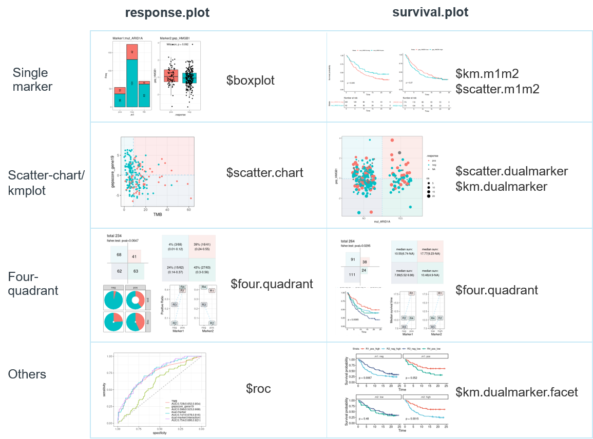
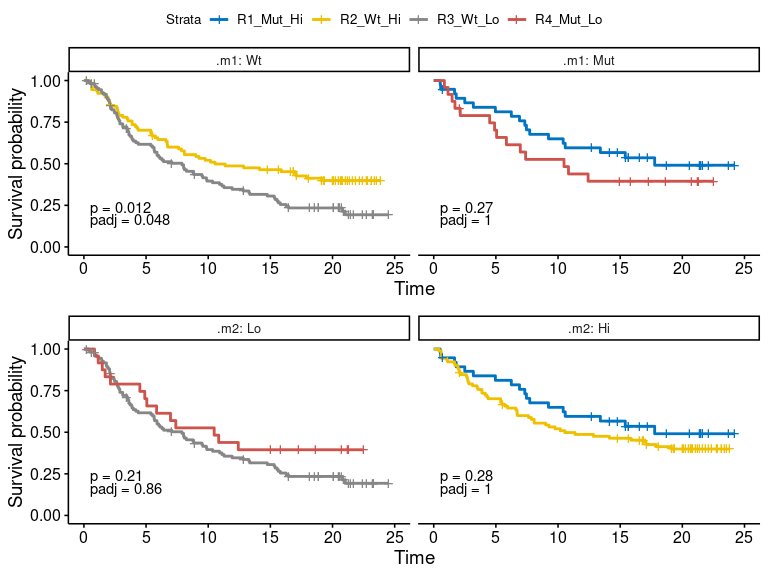
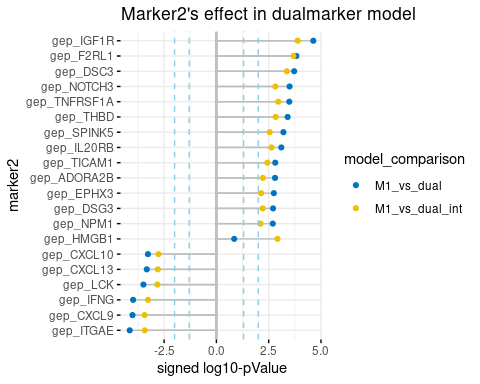

<!-- README.md is generated from README.Rmd. Please edit that file -->

# dualmarker

<!-- badges: start -->

<!-- badges: end -->

*dualmarker* is designed to facilitate the data mining of dual
biomarkers. It provides intuitive visualizations and extensive
assessment of two marker combinations using logistic regression model
for binary response outcome and Cox models for survival analysis.


## Installation

  - Install the latest developmental version from
    [GitHub](https://github.com/kassambara/rstatix) as follow:

<!-- end list -->

``` r
if(!require(devtools)) install.packages("devtools")
devtools::install_github("maxiaopeng/dualmarker")
```

## key functions

### dm\_pair

*dm\_pair* return the list of ‘response’ and ‘survival’, which contains
plot in ‘plot’ and statistics in ‘stats’, shown in the following
structure:

  - response.plot
      - boxplot
      - scatter.chart
      - four.quadrant
      - roc
  - response.stats
      - logit
      - four.quadrant
          - param
          - stats
  - survival.plot
      - km.m1m2
      - scatter.m1m2
      - km.dualmarker
      - km.dualmarker.facet
      - scatter.dualmarker
      - four.quadrant
  - survival.stats
      - cox
      - four.quadrant
          - param
          - stats

the overall plot:


### *dm\_searchM2\_logit*/*dm\_searchM2\_cox*

## dataset

We demonstrate the data using
[Imvigor210](http://research-pub.gene.com/IMvigor210CoreBiologies)
biomarker data. The demographic info, clinical efficacy and biomarker
data is stored in **clin\_bmk\_IMvigor210** dataframe, with gene
expression containing ‘gep\_’ prefix, gene signature score containing
‘gepscore\_’ prefix and mutation containing ‘mut\_’ prefix. The gene
expression profiling(GEP) data is pre-processed according to the
IMvigor210CoreBiologies package. Gene signature score is calculated for
*hallmark* genesets from MsigDBv7.0 as well as signatures from the
IMvigor210CoreBiologies package.

## Example1

Here we demonstrate the combination of TMB and TGF-beta gene signature
for response analysis using *dm\_pair* function. This pair of biomarker
is studied in [Nature.2018
Feb 22;554(7693):544-548](https://pubmed.ncbi.nlm.nih.gov/29443960/).
The *response* should be dichotomous by setting *response.pos* and
*response.neg* values.

``` r
## basic example code
res.pair <- dm_pair(data = clin_bmk_IMvigor210, 
                    response = "binaryResponse",  
                    response.pos = "CR/PR", response.neg = "SD/PD", 
                    marker1 = "TMB", marker2 = "gepscore_TGFb.19gene")
```

  - plot1: single marker for response correlation between single marker
    and response is shown in boxplot, and pvalue of wilcoxon test
    between positive and negative response is added to the plot.

<!-- end list -->

``` r
res.pair$response.plot$boxplot
```

<!-- -->

  - plot2: Scatter-chart for response The correlation between marker1,
    maker2 and response is shown in scatter-chart. If marker1 or marker2
    is categorical, the jitter plot is shown with color indicating
    response.

<!-- end list -->

``` r
res.pair$response.plot$scatter.chart
```

<!-- -->

  - plot3: Four-quadrant plot of response Samples are split into four
    groups/quadrants, according to cutoff for continuous markers,
    default using ‘median’. The independence of each quadrant is tested
    by Fisher exact test. Response rate, sample size and confidence
    interval are shown in matrix, donut chart and line chart. For the
    donut chart, response rate is corresponding to red arc fraction and
    sample size to width of ring, and the line chart reveals the
    response rate and potential statistical interaction for two markers
    if lines are crossed.

<!-- end list -->

``` r
res.pair$response.plot$four.quadrant
```

<!-- -->

  - plot4: ROC curve The single and dual marker prediction of response
    is also shown on ROC curve. Logistics regression model is applied w/
    or w/o interaction term between two biomarkers. AUC value and its
    confidence interval is also drawn on the graph.

<!-- end list -->

``` r
res.pair$response.plot$roc
```

<!-- -->

  - plot5: survival plot not available here, see in next example

  - plot6: Four-quadrant plot of survival not available here, see in
    next example

  - stats1: Four-quadrant statistics of response
    *\(stats\)response.4quad* contains four-quadrant statistics of
    response

  - *param* contains the note of marker1,marker2, cutoff methods et al

  - *stats* contains the sample number, resposne rate and its confidence
    interval in each quadrant, R1-R4

<!-- end list -->

``` r
res.4q <- res.pair$response.stats$four.quadrant
res.4q$param
#> # A tibble: 1 x 7
#>   response    response.pos response.neg m1    m2         cutpoint.m1 cutpoint.m2
#>   <chr>       <chr>        <chr>        <chr> <chr>            <dbl>       <dbl>
#> 1 binaryResp… CR/PR        SD/PD        TMB   gepscore_…           8      -0.172
res.4q$stats
#> # A tibble: 4 x 9
#>   region .m1.level .m2.level n.total n.pos n.neg pct.pos pos.lower95 pos.upper95
#>   <chr>  <chr>     <chr>       <int> <int> <int>   <dbl>       <dbl>       <dbl>
#> 1 R1     pos       pos            41    16    25  0.390      0.242         0.555
#> 2 R2     neg       pos            68     3    65  0.0441     0.00919       0.124
#> 3 R3     neg       neg            62    15    47  0.242      0.142         0.367
#> 4 R4     pos       neg            63    27    36  0.429      0.305         0.560
```

  - stats2: logistic regression result Four logistic regression models
    are built, and model comparison is performed to test the difference
    of dual-marker model and single-marker model by Likihood ratio
    test(LRT) using *anova* function for model3-vs-model1,
    model4-vs-model1, model3-vs-model2, model4-vs-model2.

  - model1: R \~ m1, labeled as ‘M1’ for short

  - model2: R \~ m2, labeled as ‘M2’ for short

  - model3: R \~ m1 + m2, labeled as ‘MD’ for short, i.e. dual-marker

  - model4: R \~ m1 \* m2 (with interaction term), labeled as ‘MDI’ for
    short, i.e. dual-marker with interaction

Logistic regression models return the following information 1. basic
parameters: response, marker1(m1), marker2(m2), cut point of for
continuous m1/m2, positive/negative values for categorical m1/2 2.
logistic regression parameters: the weight(estimate) and p-value(Wald
test) of each predictive variable in model1(m1), model2(m2), model3(md),
model4(mdi). ‘mdi\_.m1:.m2\_estimate’ and ‘mdi\_.m1:.m2\_pval’ is the
interaction term for marker1 and marker2. 3. AIC: AIC of model-m1,m2,md
and mdi 4. model comparison: p-value of LRT for m1-vs-null(R \~ 1, no
marker), m2-vs-null, m1-vs-md, m2-vs-md, m1-vs-mdi, m2-vs-mdi.

``` r
dplyr::glimpse(res.pair$response.stats$logit)
#> Rows: 1
#> Columns: 36
#> $ response               <chr> "binaryResponse"
#> $ response.pos           <chr> "CR/PR"
#> $ response.neg           <chr> "SD/PD"
#> $ m1                     <chr> "TMB"
#> $ m2                     <chr> "gepscore_TGFb.19gene"
#> $ confound.factor        <chr> ""
#> $ cutpoint.m1            <lgl> NA
#> $ cutpoint.m2            <lgl> NA
#> $ m1.cat.pos             <chr> ""
#> $ m1.cat.neg             <chr> ""
#> $ m2.cat.pos             <chr> ""
#> $ m2.cat.neg             <chr> ""
#> $ m1_.m1_estimate        <dbl> 0.09963989
#> $ m1_.m1_p.value         <dbl> 1.395883e-06
#> $ m2_.m2_estimate        <dbl> -0.1199803
#> $ m2_.m2_p.value         <dbl> 0.02516686
#> $ md_.m1_estimate        <dbl> 0.09663392
#> $ md_.m1_p.value         <dbl> 2.582342e-06
#> $ md_.m2_estimate        <dbl> -0.08748326
#> $ md_.m2_p.value         <dbl> 0.135587
#> $ mdi_.m1_estimate       <dbl> 0.119926
#> $ mdi_.m1_p.value        <dbl> 1.162081e-06
#> $ mdi_.m2_estimate       <dbl> -0.2967303
#> $ mdi_.m2_p.value        <dbl> 0.003635338
#> $ `mdi_.m1:.m2_estimate` <dbl> 0.0182465
#> $ `mdi_.m1:.m2_p.value`  <dbl> 0.007925505
#> $ m1_AIC                 <dbl> 239.2481
#> $ m2_AIC                 <dbl> 267.3176
#> $ md_AIC                 <dbl> 238.98
#> $ mdi_AIC                <dbl> 233.9904
#> $ pval.m1.vs.null        <dbl> 7.993656e-09
#> $ pval.m2.vs.null        <dbl> 0.02249407
#> $ pval.m1.vs.md          <dbl> 0.1320594
#> $ pval.m2.vs.md          <dbl> 3.630161e-08
#> $ pval.m1.vs.mdi         <dbl> 0.009765815
#> $ pval.m2.vs.mdi         <dbl> 7.84323e-09
```

  - stats-3: Four-quadrant statistics of survival not available here,
    see next example

  - stats-4: Cox regression result not available here, see next example

## Example2

Here we demonstrated the visualization of CXCL13 expression and ARID1A
mutation status, this biomarker pair is studied by [Sci Transl Med. 2020
Jun 17;12(548):eabc4220](https://pubmed.ncbi.nlm.nih.gov/32554706/), we
showed the same result.

``` r
res.pair <- dm_pair(data = clin_bmk_IMvigor210, 
               # survival info
               time = "os", event = "censOS",
               marker1 = "mut_ARID1A", marker2 = "gep_CXCL13", 
               m1.cat.pos = "YES", m1.cat.neg = "NO",
               m2.num.cut = "median")
```

  - plot-1: single markers for response Not available here

  - plot-2: scatter chart for response Not available here

  - plot-3: Four-quadrant response rate, not shown here Not available
    here

  - plot-4: ROC curve, not shown here Not available here

  - plot-5: single marker for survival

<!-- end list -->

``` r
res.pair$survival.plot$km.m1m2
```

<!-- -->

``` r
res.pair$survival.plot$scatter.m1m2
```

<!-- -->

plot-6: dual marker for survival

``` r
res.pair$survival.plot$km.dualmarker
```

<!-- -->

``` r
res.pair$survival.plot$km.dualmarker.facet
```

<!-- -->

``` r
res.pair$survival.plot$scatter.dualmarker
```

<!-- -->

plot-7: four-quadrant show of survival

``` r
res.pair$survival.plot$four.quadrant
```

<!-- -->

  - stats-1: four quadrant response not shown here

  - stats-2: summary of logit for response not shown here

  - stats-3: four quadrant stats of survival

<!-- end list -->

``` r
stats.4q <- res.pair$survival.stats$four.quadrant
stats.4q$param
#> # A tibble: 1 x 10
#>   time  event marker1 marker2 cutpoint.m1 m1.cat.pos m1.cat.neg cutpoint.m2
#>   <chr> <chr> <chr>   <chr>   <lgl>       <chr>      <chr>            <dbl>
#> 1 os    cens… mut_AR… gep_CX… NA          YES        NO               0.124
#> # … with 2 more variables: m2.cat.pos <chr>, m2.cat.neg <chr>
stats.4q$stats
#> # A tibble: 4 x 8
#>   .quadrant .m1   .m2   records events median `0.95LCL` `0.95UCL`
#>   <fct>     <fct> <fct>   <dbl>  <dbl>  <dbl>     <dbl>     <dbl>
#> 1 R1        pos   high       38     18  17.8       9.23     NA   
#> 2 R2        neg   high       91     53  10.5       6.74     NA   
#> 3 R3        neg   low       111     82   7.89      5.52      9.86
#> 4 R4        pos   low        24     14  10.5       4.90     NA
```

stats-4: stats of cox

``` r
dplyr::glimpse(res.pair$survival.stats$cox)
#> Rows: 1
#> Columns: 35
#> $ time                   <chr> "os"
#> $ even                   <chr> "censOS"
#> $ m1                     <chr> "mut_ARID1A"
#> $ m2                     <chr> "gep_CXCL13"
#> $ confound.factor        <chr> ""
#> $ cutpoint_m1            <lgl> NA
#> $ cutpoint_m2            <lgl> NA
#> $ m1.cat.pos             <chr> "YES"
#> $ m1.cat.neg             <chr> "NO"
#> $ m2.cat.pos             <chr> ""
#> $ m2.cat.neg             <chr> ""
#> $ m1_.m1_estimate        <dbl> -0.3931839
#> $ m1_.m1_p.value         <dbl> 0.04572493
#> $ m2_.m2_estimate        <dbl> -0.2869317
#> $ m2_.m2_p.value         <dbl> 0.0001590714
#> $ md_.m1_estimate        <dbl> -0.3134224
#> $ md_.m1_p.value         <dbl> 0.1149989
#> $ md_.m2_estimate        <dbl> -0.2676217
#> $ md_.m2_p.value         <dbl> 0.0004277342
#> $ mdi_.m1_estimate       <dbl> -0.3045374
#> $ mdi_.m1_p.value        <dbl> 0.1233496
#> $ mdi_.m2_estimate       <dbl> -0.2463571
#> $ mdi_.m2_p.value        <dbl> 0.002164497
#> $ `mdi_.m1:.m2_estimate` <dbl> -0.1938994
#> $ `mdi_.m1:.m2_p.value`  <dbl> 0.4121259
#> $ m1_AIC                 <dbl> 1695.692
#> $ m2_AIC                 <dbl> 1686.086
#> $ md_AIC                 <dbl> 1685.451
#> $ mdi_AIC                <dbl> 1686.794
#> $ pval.m1.vs.null        <dbl> 0.03779216
#> $ pval.m2.vs.null        <dbl> 0.0001907733
#> $ pval.m1.vs.md          <dbl> 0.0004674887
#> $ pval.m2.vs.md          <dbl> 0.1044939
#> $ pval.m1.vs.mdi         <dbl> 0.001582535
#> $ pval.m2.vs.mdi         <dbl> 0.1928236
```

## Example3

find the candidate marker2 in gene expression to combine with ARID1A
mutation

``` r
m2.candidates <- stringr::str_subset(colnames(clin_bmk_IMvigor210),"gep_") 
res.m2.cox <- dm_searchM2_cox(
  data = clin_bmk_IMvigor210, 
   # survival
   time = "os", 
   event = "censOS",
   # marker1
   marker1 = "mut_ARID1A", 
   m1.binarize = T, 
   m1.cat.pos = "YES", 
   m1.cat.neg = "NO", 
   # marker2
   m2.candidates = m2.candidates
  )
```

Plot the searchM2 result, the top20 most significant marker2 is shown

``` r
plot.m2.cox <- dm_searchM2_topPlot(res.m2.cox, top.n = 20)
```

  - plot-1, marker2 effect. ‘m2\_effect’ is dot-chart, showing the top
    significant marker2s, whose introduction to dual-maker model(w/ or
    w/o interaction) significantly increase the prediction of survival.
    Likelihood ratio test(LRT) is carried out to compare dual-marker
    model and marker1 solo model, the signed log10-pValue is shown on
    x-axis, and ‘sign’ indicates the effect direction of marker2 to
    survival.

<!-- end list -->

``` r
plot.m2.cox$m2_effect
```

<!-- -->

  - plot-2, marker2’s interaction. ‘interaction’ is dot-chart, showing
    the top significant marker2s, which has statistical interaction with
    given marker1. Signed log10-pValue is shown like ‘m2\_effect’

<!-- end list -->

``` r
plot.m2.cox$interact
```

<!-- -->

  - plot-3: m1 and m2 effect ‘m1\_m2\_effect’ is scatter-plot, showing
    the log10-pValue of model comparison, i.e. dual-vs-marker1 and
    dual-vs-marker2. Dual model that superior to both marker1 and
    marker2 is preferred, located top-right on the figure.

<!-- end list -->

``` r
plot.m2.cox$m1_m2_effect
```

<!-- -->

  - stats-1: cox result

<!-- end list -->

``` r
dplyr::glimpse(res.m2.cox)
#> Rows: 1,268
#> Columns: 35
#> $ time                   <chr> "os", "os", "os", "os", "os", "os", "os", "os"…
#> $ even                   <chr> "censOS", "censOS", "censOS", "censOS", "censO…
#> $ m1                     <chr> "mut_ARID1A", "mut_ARID1A", "mut_ARID1A", "mut…
#> $ m2                     <chr> "gep_ADA", "gep_AKT3", "gep_CD24", "gep_BCL2L1…
#> $ confound.factor        <chr> "", "", "", "", "", "", "", "", "", "", "", ""…
#> $ cutpoint_m1            <lgl> NA, NA, NA, NA, NA, NA, NA, NA, NA, NA, NA, NA…
#> $ cutpoint_m2            <lgl> NA, NA, NA, NA, NA, NA, NA, NA, NA, NA, NA, NA…
#> $ m1.cat.pos             <chr> "YES", "YES", "YES", "YES", "YES", "YES", "YES…
#> $ m1.cat.neg             <chr> "NO", "NO", "NO", "NO", "NO", "NO", "NO", "NO"…
#> $ m2.cat.pos             <chr> "", "", "", "", "", "", "", "", "", "", "", ""…
#> $ m2.cat.neg             <chr> "", "", "", "", "", "", "", "", "", "", "", ""…
#> $ m1_.m1_estimate        <dbl> -0.3931839, -0.3931839, -0.3931839, -0.3931839…
#> $ m1_.m1_p.value         <dbl> 0.04572493, 0.04572493, 0.04572493, 0.04572493…
#> $ m2_.m2_estimate        <dbl> 0.020472278, -0.088602489, -0.040055394, -0.11…
#> $ m2_.m2_p.value         <dbl> 0.7921732808, 0.2316870325, 0.5845798870, 0.13…
#> $ md_.m1_estimate        <dbl> -0.3925669, -0.3902232, -0.3992445, -0.3964988…
#> $ md_.m1_p.value         <dbl> 0.04608730, 0.04740445, 0.04273637, 0.04396925…
#> $ md_.m2_estimate        <dbl> 0.018169157, -0.086696989, -0.048006083, -0.11…
#> $ md_.m2_p.value         <dbl> 0.815536324, 0.243180093, 0.514144401, 0.13210…
#> $ mdi_.m1_estimate       <dbl> -0.4642526, -0.3999853, -0.4101674, -0.3948740…
#> $ mdi_.m1_p.value        <dbl> 0.02572344, 0.04411029, 0.03869969, 0.04542806…
#> $ mdi_.m2_estimate       <dbl> 0.094208982, -0.069846691, -0.092351419, -0.15…
#> $ mdi_.m2_p.value        <dbl> 0.284405899, 0.402004262, 0.263768116, 0.07853…
#> $ `mdi_.m1:.m2_estimate` <dbl> -0.37225167, -0.08245620, 0.22222076, 0.175550…
#> $ `mdi_.m1:.m2_p.value`  <dbl> 0.05473952, 0.65399403, 0.23758675, 0.35539251…
#> $ m1_AIC                 <dbl> 1695.692, 1695.692, 1695.692, 1695.692, 1695.6…
#> $ m2_AIC                 <dbl> 1699.937, 1698.583, 1699.707, 1697.803, 1697.6…
#> $ md_AIC                 <dbl> 1697.637, 1696.336, 1697.266, 1695.415, 1695.9…
#> $ mdi_AIC                <dbl> 1695.951, 1698.136, 1697.843, 1696.573, 1697.7…
#> $ pval.m1.vs.null        <dbl> 0.03779216, 0.03779216, 0.03779216, 0.03779216…
#> $ pval.m2.vs.null        <dbl> 0.792048437, 0.232822940, 0.584731219, 0.13776…
#> $ pval.m1.vs.md          <dbl> 0.815428198, 0.244342092, 0.514221058, 0.13133…
#> $ pval.m2.vs.md          <dbl> 0.03812741, 0.03933856, 0.03508215, 0.03618768…
#> $ pval.m1.vs.mdi         <dbl> 0.154071909, 0.459326828, 0.396740154, 0.21028…
#> $ pval.m2.vs.mdi         <dbl> 0.01844880, 0.10824010, 0.05327299, 0.07316198…
```

## Related articles

  - [Nature.2018
    Feb 22;554(7693):544-548](https://pubmed.ncbi.nlm.nih.gov/29443960/)
  - [Sci Transl Med. 2020
    Jun 17;12(548):eabc4220](https://pubmed.ncbi.nlm.nih.gov/32554706/)
